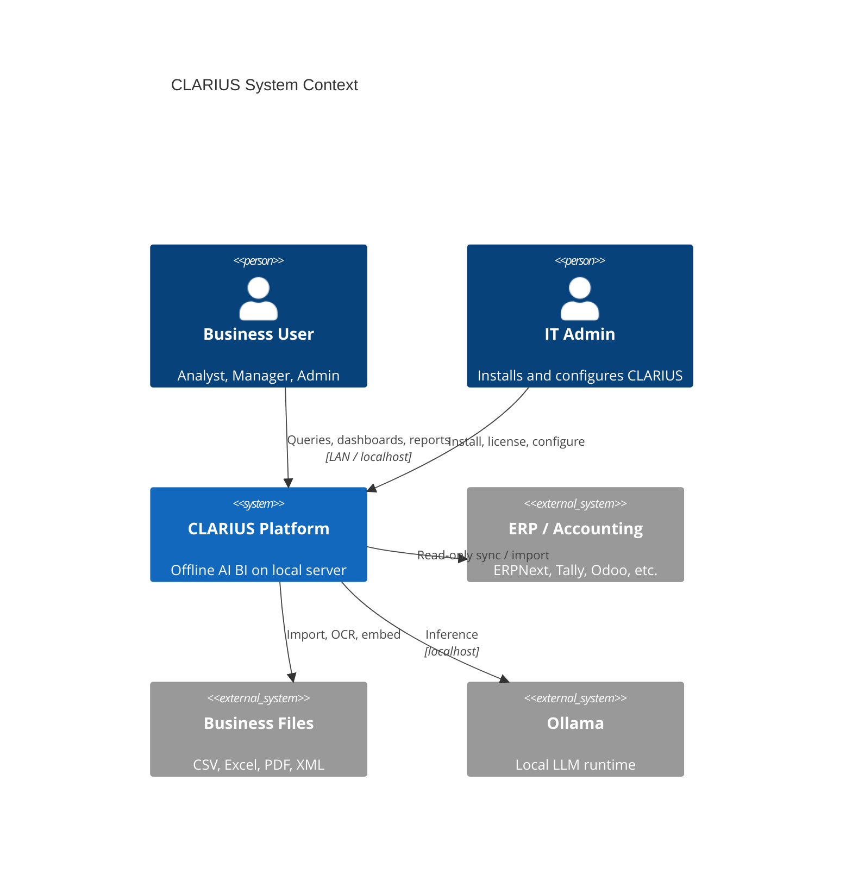
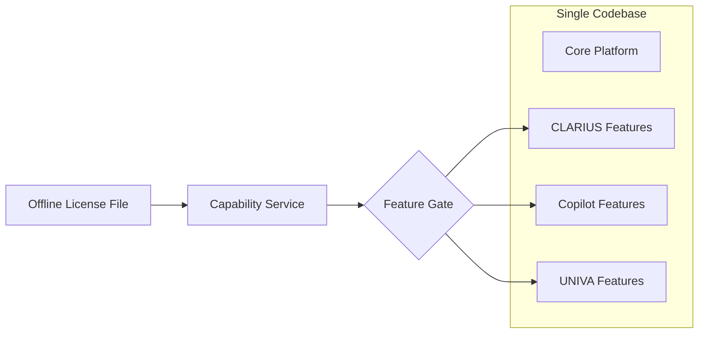
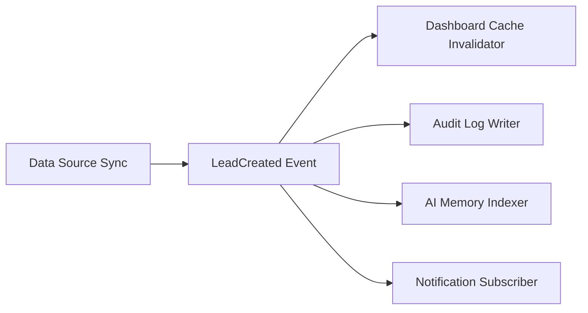

# ADR-000: Master System Architecture

## Status

**Accepted (rev. 2)** — 2026-07-19  
*Rev. 2 incorporates: separated frontend/backend features, Data vs Knowledge layers, plugin taxonomy, AI layer split, event bus, background jobs, hierarchical settings.*

## Context

CLARIUS is an offline, on-premises AI Business Intelligence platform for MSMEs. Three product editions — CLARIUS, CLARIUS Copilot, and UNIVA — must share a **single codebase** with features unlocked by license. The platform integrates with existing ERP/accounting systems without replacing them.

**Constraints:**

| Constraint | Value |
|------------|-------|
| Team size | 4 engineers |
| MVP deadline | August 15, 2026 |
| Target vertical | All MSMEs (horizontal, not industry-specific) |
| Deployment | Offline, on-premises, LAN-accessible |
| Cloud dependency | None |

**Quality attributes (priority order for MVP):**

1. Offline reliability
2. Security & data privacy
3. Maintainability (Clean Architecture)
4. Performance (local-first)
5. Extensibility (plugins, editions)
6. Scalability (future multi-branch)

---

## Decision

Adopt **Clean Architecture** with a **feature-module monorepo**, a **Tauri desktop shell**, a **local FastAPI sidecar**, and **capability-based feature gating** tied to offline licensing.

### System Context



### Layer Model

```
┌──────────────────────────────────────────────────────────────────┐
│                     PRESENTATION LAYER                            │
│  apps/desktop (Tauri + React features) │ Browser Client (future) │
│  Zustand │ TanStack Query │ packages/ui (design system)           │
└────────────────────────────┬─────────────────────────────────────┘
                             │ REST / SSE / WebSocket (client-agnostic)
┌────────────────────────────▼─────────────────────────────────────┐
│                     APPLICATION LAYER                             │
│  modules/*/application — Use Cases │ Orchestrators │ Handlers      │
└────────────────────────────┬─────────────────────────────────────┘
                             │ depends on interfaces only
┌────────────────────────────▼─────────────────────────────────────┐
│                       DOMAIN LAYER                                  │
│  modules/*/domain │ packages/shared-kernel │ Domain Events          │
└────────────────────────────┬─────────────────────────────────────┘
                             │ implemented by
┌────────────────────────────▼─────────────────────────────────────┐
│                   INFRASTRUCTURE LAYER                              │
│  database/ (DuckDB) │ knowledge/ (ChromaDB) │ ai/ │ plugins/       │
│  jobs/ │ events/ │ security/ │ licensing/ │ settings/             │
└──────────────────────────────────────────────────────────────────┘
```

**Dependency rule:** Dependencies point inward. Domain knows nothing about FastAPI, React, DuckDB, or Ollama.

**Frontend/backend separation:** React features live in `apps/desktop/src/features/`. Python modules live in `modules/`. They share contracts via `packages/shared-types` (OpenAPI-generated). Never co-locate UI inside backend modules — UI evolves faster and coupling becomes painful at scale.

### Storage Layer Distinction

| Layer | Engine | Responsibility |
|-------|--------|----------------|
| **Data Layer** | DuckDB (`infrastructure/database/`) | Business transactions, CDM, analytics, agent metadata |
| **Knowledge Layer** | ChromaDB (`infrastructure/knowledge/`) | Document embeddings, schema embeddings, semantic retrieval |

These are not interchangeable. Different lifecycles, backup strategies, and access patterns.

### Edition Model (Single Codebase)



| Edition | Capability Namespace | MVP (Aug 15) |
|---------|---------------------|--------------|
| CLARIUS | `clarius.*` | **Ship** |
| CLARIUS Copilot | `copilot.*` | Stub + license gate |
| UNIVA | `univa.*` | Stub + license gate |

### Monorepo Layout (Authoritative)

```
CLARIUS/
├── apps/
│   ├── desktop/                         # Tauri + React
│   │   └── src/
│   │       └── features/                # Frontend features (separate from backend)
│   │           ├── analytics/
│   │           ├── dashboards/
│   │           ├── documents/
│   │           ├── identity/
│   │           ├── reports/
│   │           ├── settings/
│   │           └── data-sources/
│   └── api/                             # FastAPI entrypoint
├── packages/
│   ├── ui/                              # shadcn design system, layout shells
│   ├── shared-types/                    # OpenAPI-generated TS types
│   ├── shared-kernel/                   # Cross-module domain primitives, event types
│   └── config/                          # ESLint, TS, Tailwind presets
├── modules/                             # Backend feature modules (Python only)
│   ├── identity/
│   ├── analytics/
│   ├── documents/
│   ├── reports/
│   ├── dashboards/
│   ├── data-sources/
│   └── audit/
├── ai/                                  # AI layer (NOT generic infrastructure)
│   ├── llm/                             # Ollama client, model registry
│   ├── agents/                          # LangGraph agents + orchestrator
│   ├── memory/                          # Conversation + query memory
│   ├── embeddings/                      # Sentence Transformers
│   ├── ocr/                             # PaddleOCR
│   ├── prompts/                         # Prompt templates (versioned)
│   ├── tools/                           # Agent tools (SQL, chart, search)
│   └── guardrails/                      # SQL safety, output filters
├── plugins/                             # Plugin host + categories
│   ├── erp/                             # ERPNext, Tally, Odoo, ...
│   ├── data/                            # CSV, Excel, XML, REST
│   ├── ai/                              # Custom agent plugins
│   ├── automation/                      # Workflow plugins (UNIVA)
│   └── exports/                         # PDF, Excel report exporters
├── infrastructure/
│   ├── database/                        # DuckDB — Data Layer
│   ├── knowledge/                         # ChromaDB — Knowledge Layer
│   ├── security/                        # Crypto, vault, session store
│   ├── licensing/                       # License verification
│   ├── settings/                        # Hierarchical settings store
│   ├── jobs/                            # Background job scheduler + queue
│   └── events/                          # Domain event bus
├── docs/architecture/
└── tools/
```

### Backend Feature Module Contract

Every backend module under `modules/{feature}/`:

```
modules/{feature}/
├── domain/           # Entities, value objects, interfaces, domain events
├── application/      # Use cases, command/query handlers
├── infrastructure/   # Repositories (implements domain interfaces)
└── api/              # FastAPI routers (thin — delegate to application)
```

### Frontend Feature Module Contract

Every frontend feature under `apps/desktop/src/features/{feature}/`:

```
features/{feature}/
├── components/
├── hooks/
├── services/         # API client wrappers (uses shared-types)
├── stores/           # Zustand slices (feature-local)
├── types/            # UI-only types (never duplicate API types)
└── tests/
```

**Cross-feature UI sharing:** Use `packages/ui` for design system primitives. Never import across `features/*` directly — extract shared UI to `packages/ui` or `features/shared/`.

### Inter-Module Communication

Modules MUST NOT call each other directly for side effects. Use:

1. **Domain interfaces** (injected via DI) for synchronous reads
2. **Domain Event Bus** (ADR-007) for asynchronous reactions
3. **Background Jobs** (ADR-008) for long-running work



### Cross-Cutting Concerns

| Concern | Owner Module | Enforcement Point |
|---------|--------------|-------------------|
| Authentication | `identity` | API middleware, Tauri session |
| Authorization (RBAC) | `rbac` | API middleware + UI route guards |
| Licensing | `licensing` | Startup + API middleware + UI |
| Audit logging | `audit` | Decorator on write operations |
| Configuration | `infrastructure/settings` | Hierarchical settings (ADR-010) |
| Background jobs | `infrastructure/jobs` | Import, OCR, sync, indexing (ADR-008) |
| Domain events | `infrastructure/events` | Event bus (ADR-007) |
| Migrations | `infrastructure/database` + `settings` | Schema + config versioning (ADR-009) |

### Deployment Modes

| Mode | Description | MVP |
|------|-------------|-----|
| **Single User** | One machine, localhost only | Yes |
| **Office LAN** | Server on LAN; desktop OR browser clients | Yes (desktop MVP; API browser-ready day one) |
| **Enterprise** | Multi-branch, centralized server | Post-MVP (interfaces only) |

### Horizontal MSME Strategy (All Verticals)

MVP avoids industry-specific logic. Instead:

- **Generic business entities:** Sales, Purchases, Inventory, Customers, Suppliers, Payments, Expenses
- **Configurable schema mapping:** User maps their CSV/ERP columns to canonical entities
- **Document intelligence:** Vertical-agnostic (invoices, bills, reports)
- **Dashboard templates:** Generic KPIs (revenue, outstanding, stock, margins) — not textile-specific workflows

Industry packs become **plugins post-MVP**, not core architecture.

---

## Consequences

### Positive

- One codebase scales to three products without fork drift
- Clean Architecture enables parallel work across 4 engineers
- Offline-first satisfies privacy-sensitive MSME buyers
- Capability gating is testable without mocking editions everywhere

### Negative

- Sidecar FastAPI adds process management complexity in Tauri
- Two languages (TypeScript + Python) require shared contract discipline (OpenAPI)
- LangGraph agent pipeline has learning curve for team

### Risks & Mitigations

| Risk | Mitigation |
|------|------------|
| Aug 15 scope creep | ADR-006 defines strict MVP boundary |
| Agent latency on local LLM | Async UI, streaming, query caching |
| ERP connector complexity | MVP: CSV/Excel + one REST generic connector |
| 4-person bottleneck | Module ownership matrix in ADR-006 |

---

## Alternatives Considered

### A1: Separate apps per edition

**Rejected.** Triples maintenance cost; violates product strategy.

### A2: Electron + embedded Python

**Rejected.** Larger bundle, weaker security sandbox vs Tauri; harder LAN deployment.

### A3: All-in-one Python (NiceGUI / Streamlit)

**Rejected.** Cannot deliver enterprise desktop UX, offline licensing UX, or rich dashboards at MSME quality bar.

### A4: Cloud-first with offline cache

**Rejected.** Violates core product promise (privacy, no internet dependency).

---

## References

- ADR-001: Monorepo & Deployment
- ADR-002: Offline Licensing
- ADR-003: RBAC
- ADR-004: Agent Pipeline
- ADR-005: Data Layer & Knowledge Layer
- ADR-006: MVP Delivery Plan
- ADR-007: Domain Event Bus
- ADR-008: Background Jobs Layer
- ADR-009: Migration Service
- ADR-010: Hierarchical Settings
- ADR-011: Plugin Architecture
