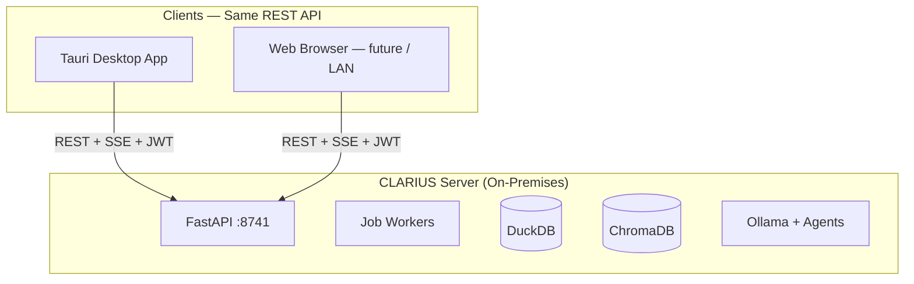
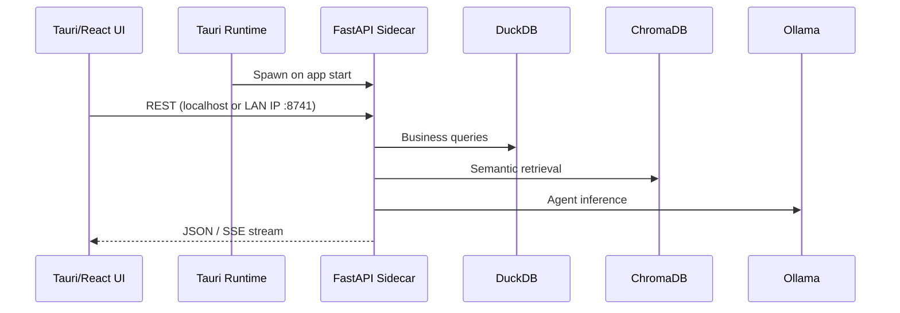
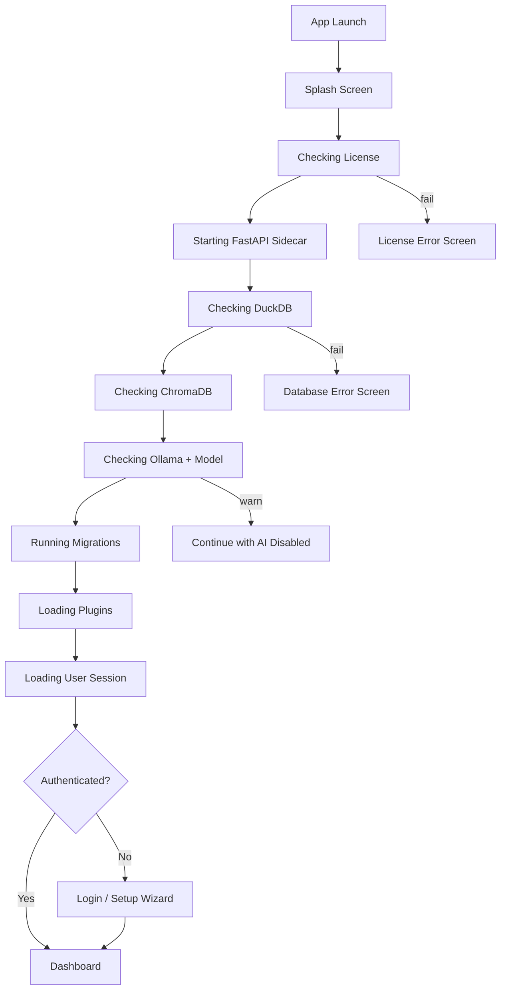

# ADR-001: Monorepo & On-Premises Deployment

## Status

**Accepted (rev. 2)** — 2026-07-19  
*Rev. 2: Separated frontend/backend features, professional startup sequence, browser-compatible API design.*

## Context

CLARIUS must run fully offline on a local office server with employees connecting over LAN via **desktop client or web browser**. The stack spans Tauri (Rust shell), React (TypeScript UI), and Python (FastAPI + AI). A team of 4 must work in parallel without merge conflicts or ambiguous ownership.

---

## Decision

### Monorepo Layout

See ADR-000 for the authoritative folder tree. Key principle:

| Location | Contains |
|----------|----------|
| `apps/desktop/src/features/` | React feature folders (presentation) |
| `modules/` | Python backend features (domain + application) |
| `ai/` | LLM, agents, memory, OCR, prompts, tools, guardrails |
| `plugins/` | ERP, data, AI, automation, export plugins |
| `infrastructure/database/` | DuckDB — **Data Layer** |
| `infrastructure/knowledge/` | ChromaDB — **Knowledge Layer** |
| `infrastructure/jobs/` | Background job scheduler + workers |
| `infrastructure/events/` | Domain event bus |

**Tooling:**

| Layer | Package Manager | Build |
|-------|-----------------|-------|
| Frontend | pnpm workspaces | Vite |
| Desktop | Tauri CLI | Rust + Vite bundle |
| Backend | uv (recommended) or poetry | Uvicorn |

### Client Architecture: Desktop OR Browser



**Decision:** Design all APIs to be **browser-compatible from day one**, even though the browser client ships post-MVP.

| Requirement | Rationale |
|-------------|-----------|
| Stateless JWT auth (httpOnly cookie option for browser) | Tauri secure storage vs browser cookies |
| CORS config for LAN origins | Browser clients on `http://192.168.x.x:8741` |
| No Tauri-specific API assumptions | All logic in FastAPI, not Rust |
| SSE for streaming (not Tauri events) | Works in browser natively |
| OpenAPI 3.1 spec | Enables future web client codegen |

**MVP ships:** Tauri desktop + LAN desktop clients pointing at server IP.  
**MVP designs for:** Browser LAN client (minimal extra work if API is clean).

### Process Architecture: Tauri + FastAPI Sidecar



**Port convention:** `8741` (CLARIUS API). Configurable via `settings.application.api_port`.

### Professional Startup Sequence

Replace simple health-check-then-load with a **staged splash screen** that reports progress to the user. This is enterprise-grade UX for a local server product.



**Startup status API:**

```
GET /startup/status
→ {
    "stage": "checking_ollama",
    "stages": [
      { "id": "license", "status": "complete" },
      { "id": "fastapi", "status": "complete" },
      { "id": "duckdb", "status": "complete" },
      { "id": "chromadb", "status": "in_progress" },
      ...
    ],
    "ready": false
  }
```

Desktop splash polls this endpoint. Browser client (future) uses the same endpoint.

**Sidecar lifecycle:**

1. Tauri starts → show splash immediately
2. Spawn `clarius-api` subprocess
3. Poll `GET /startup/status` until `ready: true` or fatal error
4. Load authenticated route or login
5. Graceful shutdown: drain job queue → flush DuckDB → close ChromaDB
6. Auto-restart on crash (max 3 retries → error screen with logs path)

### Deployment Topology

#### Single User Mode

```
┌─────────────────────────────┐
│  One Windows/Linux PC       │
│  ┌─────────┐  ┌───────────┐ │
│  │ Tauri   │→ │ FastAPI   │ │
│  │ (UI)    │  │ :8741     │ │
│  └─────────┘  └─────┬─────┘ │
│                     │       │
│         DuckDB │ ChromaDB │ Ollama │ Job Workers
└─────────────────────────────┘
```

#### Office LAN Mode

```
┌────────────────── Server PC ──────────────────┐
│  CLARIUS Server                                │
│  FastAPI :8741 (0.0.0.0) + Background Workers  │
│  DuckDB + ChromaDB + Ollama                    │
└──────────────────┬─────────────────────────────┘
                   │ LAN (port 8741)
     ┌─────────────┼─────────────┐
     ▼             ▼             ▼
  Desktop       Desktop       Browser
  Client        Client        Client
  (MVP)         (MVP)         (post-MVP UI,
                               API-ready now)
```

**MVP:** Single User + LAN server on same installer. LAN clients = desktop app configured with server IP.

### Data Directory Layout (On-Premises)

```
{CLARIUS_DATA_ROOT}/
├── settings/                        # Hierarchical settings (ADR-010)
│   ├── application.enc
│   ├── organization.enc
│   ├── integrations.enc
│   ├── ai.enc
│   ├── themes.enc
│   └── _version.json                # Settings schema version
├── license/
│   └── license.clar
├── database/                        # Data Layer
│   └── business.duckdb
├── knowledge/                         # Knowledge Layer
│   └── chroma/
├── jobs/                              # Job queue persistence
│   └── queue.db                       # SQLite job store (lightweight)
├── plugins/
│   └── installed/                     # Plugin manifests + configs
├── imports/staging/
├── exports/reports/
├── migrations/                        # Applied migration ledger
│   └── ledger.json
├── logs/
│   ├── app.log
│   └── audit.log
└── secrets/
    └── vault.enc
```

**Note:** `rbac.yaml` lives in `settings/` or is managed via settings API — not a loose config file.

### API Contract Strategy

- FastAPI generates OpenAPI 3.1 spec at `/openapi.json`
- `pnpm generate:types` → `packages/shared-types`
- **Rule:** Frontend never hand-writes API response types
- **Rule:** All endpoints work identically for desktop and browser clients
- Auth: `Authorization: Bearer <jwt>` (desktop) or httpOnly cookie (browser option)
- CORS: Configurable allowed origins in `settings.application.cors_origins`

### Browser-Ready API Checklist (Day One)

| Check | Implementation |
|-------|----------------|
| No filesystem paths in API responses | Use resource IDs only |
| File upload via multipart | Not Tauri file picker API |
| Streaming via SSE | `text/event-stream` |
| Pagination | Cursor or offset on all list endpoints |
| CSRF | Token for cookie-based browser auth (when enabled) |
| WebSocket optional | SSE sufficient for MVP streaming |

### Environment & Secrets

| Secret Type | Storage | MVP |
|-------------|---------|-----|
| DB connection strings | `secrets/vault.enc` | Yes |
| ERP API tokens | `secrets/vault.enc` | Yes |
| License public key | Embedded in binary | Yes |
| User passwords | bcrypt hashes in DuckDB | Yes |

No `.env` files in production deployments. Dev `.env.local` gitignored.

---

## Consequences

### Positive

- Frontend/backend separation prevents coupling as UI velocity outpaces backend
- Splash startup communicates professionalism and aids troubleshooting
- Browser-ready API enables web edition at low incremental cost
- Data/Knowledge path separation clarifies backup and ops

### Negative

- Startup sequence adds frontend state machine complexity
- CORS + dual auth modes require careful testing
- More top-level folders to navigate (mitigated by ADR index)

### Operational Requirements

- Installer bundles: Tauri app, Python runtime (embedded), Ollama setup guide
- Minimum hardware: 16GB RAM recommended for Qwen 3 4B
- LAN firewall documentation: allow TCP 8741

---

## Alternatives Considered

| Alternative | Why Rejected |
|-------------|--------------|
| UI inside backend modules | Creates coupling; different release cadences |
| Simple health-check startup | Poor UX; hard to diagnose startup failures |
| Browser client deferred at API level | Would require API rework later |
| ChromaDB under `database/` | Conflates two distinct storage responsibilities |

---

## References

- ADR-000: Master Architecture
- ADR-005: Data Layer & Knowledge Layer
- ADR-009: Migration Service
- ADR-010: Hierarchical Settings
