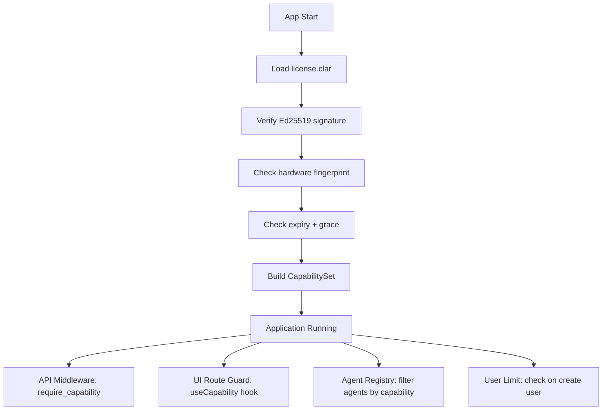

# ADR-002: Offline Licensing System

## Status

**Accepted** — 2026-07-19

## Context

CLARIUS ships three editions from one codebase. Licensing must work **fully offline** with no phone-home validation. MSME buyers expect perpetual or term licenses bound to their organization and hardware. The system must gate features at API and UI layers consistently.

**Requirements:**

- Digitally signed license file
- Controls: edition, users, organization, branches, modules, expiry, hardware fingerprint
- Tamper detection
- Grace period for expiry
- Future: license renewal without reinstall

---

## Decision

Implement **signed capability documents** (license files) validated locally using an **embedded public key**, exposing a **CapabilityService** consumed by all layers.

### License File Format

**File:** `{CLARIUS_DATA_ROOT}/license/license.clar`  
**Format:** JSON payload + Ed25519 detached signature (base64url encoded)

```json
{
  "format_version": 1,
  "license_id": "LIC-2026-0042",
  "issued_at": "2026-07-01T00:00:00Z",
  "expires_at": "2027-07-01T00:00:00Z",
  "grace_days": 14,
  "organization": {
    "id": "ORG-ACME-001",
    "name": "ACME Traders Pvt Ltd",
    "max_users": 10,
    "max_branches": 1
  },
  "edition": "clarius",
  "modules": [
    "analytics",
    "documents",
    "dashboards",
    "reports"
  ],
  "capabilities": [
    "clarius.nl_query",
    "clarius.dashboards",
    "clarius.reports",
    "clarius.ocr",
    "clarius.document_intelligence",
    "clarius.sql_generation",
    "clarius.query_memory"
  ],
  "deployment": {
    "mode": "office_lan",
    "hardware_fingerprint": "sha256:abc123...",
    "fingerprint_strictness": "moderate"
  },
  "metadata": {
    "issued_by": "CLARIUS Licensing",
    "notes": "Annual subscription"
  }
}
```

**Wire format (`license.clar`):**

```
CLARIUS-LICENSE-v1
{base64url(JSON payload)}
{base64url(Ed25519 signature)}
```

### Cryptographic Choices

| Element | Choice | Rationale |
|---------|--------|-----------|
| Signing algorithm | **Ed25519** | Fast, compact, well-supported in Python (`cryptography`) and Rust (Tauri) |
| Payload encoding | Canonical JSON (sorted keys) | Deterministic verification |
| Public key storage | Embedded in app binary + `license/public.key` override for dev | Cannot be replaced by customer |
| Private key | **Offline issuance tool only** (not in repo) | CLARIUS vendor holds key |

### Hardware Fingerprint

Composite fingerprint hashed to SHA-256:

```
fingerprint = SHA256(
  machine_guid +
  primary_disk_serial +
  cpu_id (best-effort) +
  mac_address (first physical NIC, optional)
)
```

**Strictness levels:**

| Level | Behavior | Use Case |
|-------|----------|----------|
| `none` | Skip fingerprint check | Dev / trial |
| `moderate` | Match 2 of 3 components | **MVP default** — survives RAM upgrade |
| `strict` | Match all components | High-security enterprise |

Mismatch → license status `invalid_hardware` with admin override code (vendor support flow, post-MVP).

### Edition → Capability Matrix

Capabilities are the **only** gating mechanism. Edition is a convenience label that expands to a capability set at issuance.

```yaml
# config/edition-capabilities.yaml (embedded defaults)
editions:
  clarius:
    - clarius.nl_query
    - clarius.dashboards
    - clarius.reports
    - clarius.ocr
    - clarius.document_intelligence
    - clarius.analytics
    - clarius.sql_generation
    - clarius.query_memory

  clarius_copilot:
    - clarius.*                    # All CLARIUS capabilities
    - copilot.predictive_analytics
    - copilot.trend_analysis
    - copilot.root_cause_analysis
    - copilot.recommendations
    - copilot.executive_dashboards
    - copilot.department_analytics
    - copilot.kpi_monitoring
    - copilot.scheduled_reports

  univa:
    - clarius.*
    - copilot.*
    - univa.autonomous_agents
    - univa.workflow_automation
    - univa.business_process_automation
    - univa.human_approval
    - univa.custom_plugins
    - univa.multi_location
    - univa.enterprise_workforce
```

**Wildcard resolution:** At startup, `clarius.*` expands against the edition registry. Explicit capabilities in the license file **add to or restrict** (deny wins over allow).

### CapabilityService (Domain Interface)

```python
# Domain — no infrastructure imports
class ICapabilityService(Protocol):
    def has_capability(self, capability: str) -> bool: ...
    def require_capability(self, capability: str) -> None:  # raises LicenseError
    def get_license_status(self) -> LicenseStatus: ...
    def get_limits(self) -> LicenseLimits: ...
```

**LicenseStatus enum:**

```
valid | expiring_soon | grace_period | expired | invalid_signature | invalid_hardware | not_found
```

### Enforcement Points



| Layer | Mechanism |
|-------|-----------|
| **Startup** | Block app if `expired` or `invalid_signature`. Warn if `expiring_soon`. |
| **API middleware** | `@requires_capability("clarius.nl_query")` decorator |
| **UI** | `<CapabilityGate capability="copilot.kpi_monitoring">` wrapper |
| **Agent registry** | Agents register required capabilities; unavailable agents hidden |
| **User creation** | Enforce `max_users` from license |

### User & Branch Limits

```python
@dataclass
class LicenseLimits:
    max_users: int
    max_branches: int
    current_users: int      # runtime
    current_branches: int   # runtime
```

- **MVP:** `max_branches = 1` enforced at data source registration (second branch → upgrade prompt)
- User count checked on invite/create, not on every login (performance)

### License Issuance (Vendor Tool — Outside App)

Separate CLI tool `clarius-license-issue` (internal, not shipped):

```
clarius-license-issue \
  --org "ACME Traders" \
  --edition clarius \
  --users 10 \
  --expires 2027-07-01 \
  --fingerprint sha256:abc123 \
  --output license.clar
```

Team of 4: one engineer builds this in Week 1 (2 days max). MVP can use manually crafted licenses.

### UI: License Management Screen

Admin-only screen (`identity` + `rbac`):

- View license status, expiry, edition, limits
- Import new license file (file picker → validate → atomic replace)
- Display fingerprint for customer to send to vendor

---

## Consequences

### Positive

- Zero cloud dependency; works in air-gapped factories
- Capability model scales to plugins (`plugin.erpnext_connector`)
- Same enforcement code for all editions

### Negative

- Hardware fingerprint support calls are OS-specific (Windows/Linux paths differ)
- License piracy possible with cracked binaries (acceptable for MVP; Rust obfuscation post-MVP)
- Wildcard expansion must be tested carefully

### Security Notes

- Never embed private key in any shipped artifact
- Log license validation failures to audit log (not user-facing details)
- Rate-limit license import attempts

---

## Alternatives Considered

| Alternative | Disadvantage |
|-------------|--------------|
| JWT with symmetric secret | Secret extraction from binary breaks all licenses |
| RSA-4096 | Slower, larger keys; no benefit over Ed25519 |
| Online activation (FlexLM-style) | Violates offline requirement |
| Edition string checks in code | Unmaintainable; error-prone across 3 editions |

---

## References

- ADR-000: Edition model
- ADR-003: RBAC (admin permission for license import)
- ADR-006: MVP — CLARIUS edition only fully implemented
