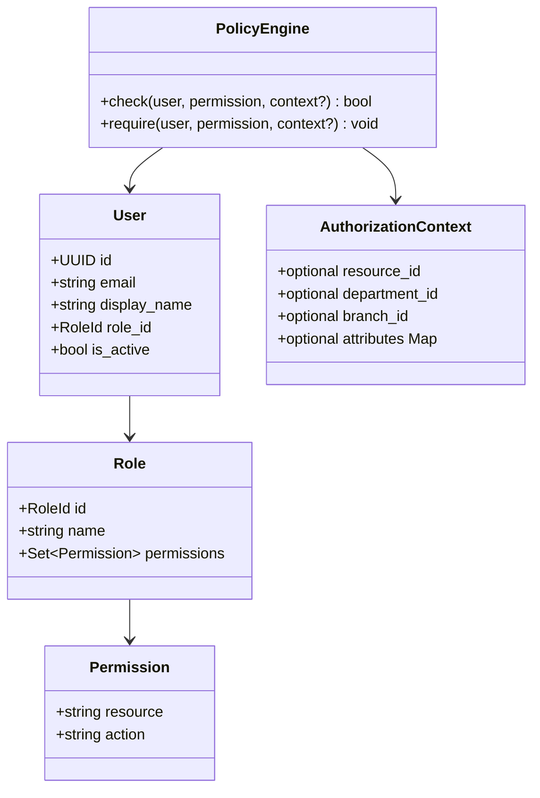
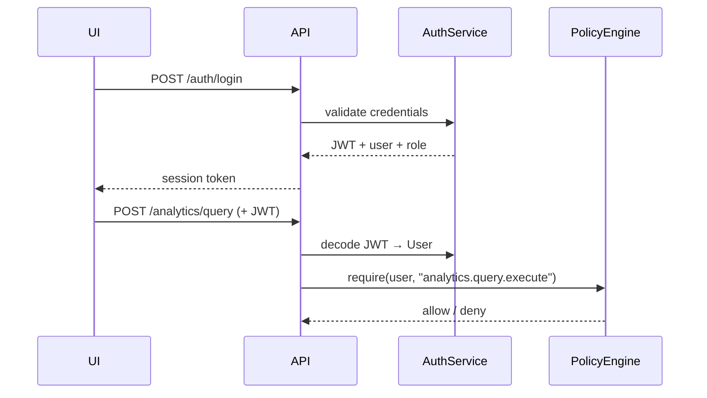

# ADR-003: RBAC Authorization Model

## Status

**Accepted** — 2026-07-19

## Context

CLARIUS serves organizations from single-owner micro businesses to 50+ user SMEs. Access control must cover dashboards, reports, data sources, documents, settings, and admin functions. The model must be **configuration-driven**, support five predefined roles, and be **future-ready for ABAC** without rewrite.

**Roles (MVP):**

| Role | Typical Persona |
|------|-----------------|
| Owner | Business proprietor, full control |
| Admin | IT / office manager, setup & users |
| Manager | Department head, team analytics |
| Analyst | Power user, queries & reports |
| Staff | Operational user, view-only dashboards |

---

## Decision

Implement **RBAC with Resource-Action permissions**, stored as **configuration (YAML)**, evaluated by a central **PolicyEngine**, with enforcement at API middleware and UI guards. Design permission checks to accept **optional attributes** for future ABAC.

### Permission Model

**Format:** `{resource}.{action}`

```yaml
# Example permissions
analytics.query.execute
analytics.query.view_history
dashboard.view
dashboard.create
dashboard.edit
dashboard.delete
dashboard.share
report.view
report.create
report.export
report.schedule          # Copilot capability-gated
data_source.view
data_source.create
data_source.sync
document.view
document.upload
document.delete
settings.view
settings.edit
user.view
user.invite
user.edit
user.deactivate
role.assign
license.view
license.import
audit.view
```

### Role-Permission Matrix (MVP Default)

```yaml
# {CLARIUS_DATA_ROOT}/config/rbac.yaml
version: 1

roles:
  owner:
    inherits: [admin]
    permissions:
      - license.import
      - role.assign

  admin:
    inherits: [manager]
    permissions:
      - data_source.create
      - data_source.sync
      - document.upload
      - document.delete
      - settings.edit
      - user.view
      - user.invite
      - user.edit
      - user.deactivate
      - license.view
      - audit.view

  manager:
    inherits: [analyst]
    permissions:
      - dashboard.create
      - dashboard.edit
      - dashboard.delete
      - dashboard.share
      - report.create
      - report.export

  analyst:
    inherits: [staff]
    permissions:
      - analytics.query.execute
      - analytics.query.view_history
      - report.view
      - document.view
      - document.upload

  staff:
    permissions:
      - dashboard.view
      - data_source.view
```

**Inheritance:** Resolved at startup into flat `Role → Set[Permission]` map. Stored in memory; reload on config change.

### Domain Model



### PolicyEngine Interface

```python
class IPolicyEngine(Protocol):
    def check(
        self,
        user: User,
        permission: str,
        context: AuthorizationContext | None = None,
    ) -> bool: ...

    def require(
        self,
        user: User,
        permission: str,
        context: AuthorizationContext | None = None,
    ) -> None: ...  # raises ForbiddenError
```

**MVP:** `context` is accepted but ignored except for audit logging.

**Future ABAC:** Add `policies/abac.yaml` with rules like:

```yaml
- permission: dashboard.view
  when:
    resource.owner_department: "{user.department_id}"
```

PolicyEngine evaluates RBAC first (must pass), then ABAC conditions if present.

### Authentication (Local, Offline)

MVP uses **local user accounts** — no OAuth, no SSO.

| Aspect | Decision |
|--------|----------|
| Password hashing | bcrypt, cost factor 12 |
| Session | JWT stored in Tauri secure storage (desktop) / httpOnly cookie (LAN) |
| Session TTL | 8 hours default, configurable |
| Lockout | 5 failed attempts → 15 min lockout |
| First run | Setup wizard creates Owner account |



### Enforcement Architecture

```
Request
  → AuthMiddleware (JWT → User)
  → LicenseMiddleware (capability for route)
  → PolicyMiddleware (RBAC permission for route)
  → Route Handler
```

**Route declaration pattern (FastAPI):**

```python
@router.post("/query")
@requires_capability("clarius.nl_query")
@requires_permission("analytics.query.execute")
async def execute_query(...): ...
```

**Frontend mirror:**

```typescript
// Route guard
<ProtectedRoute permission="dashboard.view" capability="clarius.dashboards">

// Component gate
<PermissionGate permission="report.export">
  <ExportButton />
</PermissionGate>
```

**Rule:** Frontend guards are UX only. API always enforces.

### Resource-Level Authorization (Scoped Access)

MVP implements **coarse RBAC only**. Resource-level scoping interfaces are defined but deferred:

| Resource | Future Scope Attribute | MVP |
|----------|---------------------|-----|
| Dashboard | `owner_user_id`, `shared_with[]` | All users with `dashboard.view` see all |
| Report | `department_id` | Same |
| Data Source | `branch_id` | Single branch MVP |
| Document | `folder_id`, `classification` | All with `document.view` |

**Interface ready:**

```python
class IResourceAuthorizer(Protocol):
    def can_access(self, user: User, resource_type: str, resource_id: str) -> bool: ...
```

Returns `True` for MVP. Copilot/UNIVA implement department/branch scoping.

### Multi-Role Support

**MVP:** One role per user.  
**Future:** `user.roles: List[RoleId]` with union of permissions.

Schema includes nullable `secondary_role_id` column — unused in MVP.

### Audit Integration

Every `PolicyEngine.require()` denial logs:

```json
{
  "event": "authorization.denied",
  "user_id": "...",
  "permission": "report.export",
  "resource_id": null,
  "timestamp": "..."
}
```

Successful sensitive actions (user.invite, license.import, data_source.sync) always audit logged.

### Default Role Assignment

| Scenario | Default Role |
|----------|--------------|
| First user (setup wizard) | Owner |
| Admin-invited user | Staff (Admin can change) |
| License max_users reached | Block invite with clear message |

---

## Consequences

### Positive

- YAML config allows per-customer customization without code changes
- ABAC path clear without MVP complexity
- Same PolicyEngine for API and background jobs (report scheduler)

### Negative

- YAML editing errors could lock out admins → ship config validator + factory reset path
- Single-role MVP may frustrate enterprises → documented upgrade path

### Owner vs Admin Split

Owner is the only role that can import licenses and assign Admin role. Prevents IT admin from hijacking licensing — important for MSME where owner = proprietor.

---

## Alternatives Considered

| Alternative | Disadvantage |
|-------------|--------------|
| Hardcoded role checks | Unmaintainable; cannot customize per deployment |
| Casbin / OPA full adoption | Learning curve; overkill for MVP; revisit for UNIVA |
| ABAC from day one | 4-person team cannot deliver by Aug 15 |
| No RBAC (single user only) | Blocks LAN mode and multi-user MSME sales |

---

## References

- ADR-002: Licensing (capability vs permission — orthogonal)
- ADR-000: Cross-cutting concerns
- ADR-006: MVP delivers full RBAC for 5 roles

### Capability vs Permission (Clarification)

| Dimension | Licensing (Capability) | RBAC (Permission) |
|-----------|-------------------------|-------------------|
| Question | "Did customer pay for this feature?" | "Is this user allowed to do this?" |
| Example | `copilot.scheduled_reports` | `report.schedule` |
| Both required | User needs permission **AND** org needs capability |
