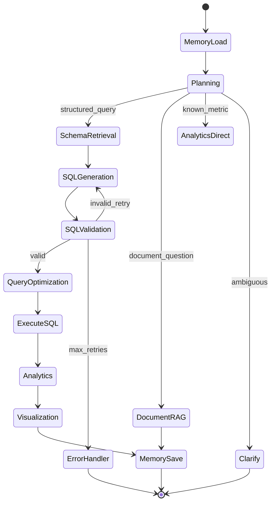
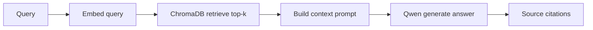
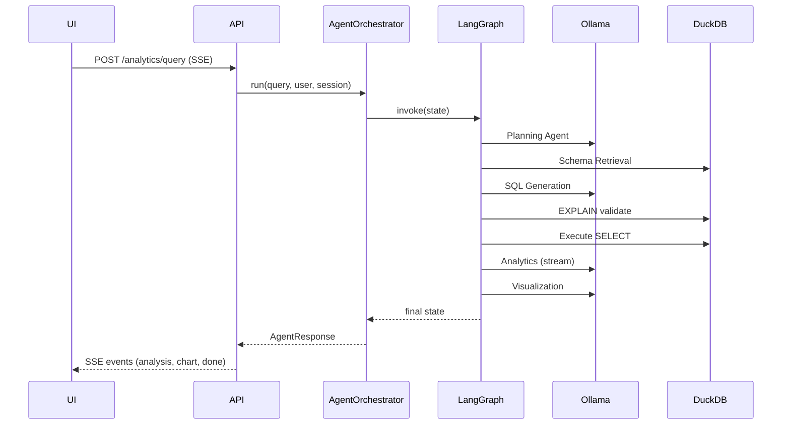

# ADR-004: AI Agent Pipeline (LangGraph)

## Status

**Accepted (rev. 2)** — 2026-07-19  
*Rev. 2: AI layer split into dedicated submodules under `ai/`.*

## Context

CLARIUS core value is natural-language business intelligence over local data. The AI stack (Ollama + Qwen 3 4B, LangGraph, LangChain, Sentence Transformers, PaddleOCR) must orchestrate multiple specialized agents reliably **offline** with acceptable latency on MSME hardware.

**Agent inventory (full product):**

Memory, Schema Retrieval, SQL Generation, SQL Validation, Query Optimization, Analytics, Visualization, Report Generation, Recommendation, Trend Analysis, Root Cause Analysis, Planning, Workflow, Plugin, Communication, Approval, Autonomous Business Agent.

**MVP constraint (Aug 15):** Implement the **core query pipeline** only. Copilot/UNIVA agents register but return "requires upgrade" unless capability present.

---

## Decision

Implement a **LangGraph state machine** with a **Planning Agent as router**, **specialist agents as nodes**, and a **shared AgentContext**. Agents are **capability-gated plugins** registered in an **AgentRegistry**.

### AI Layer Structure

The AI stack is **not** generic infrastructure. It lives in a dedicated top-level `ai/` directory with clear submodules — UNIVA will eventually host dozens of agents; a single `infrastructure/ai/` folder would become unmanageable.

```
ai/
├── llm/                    # Ollama client, model registry, streaming
│   ├── client.py
│   ├── models.py           # qwen3:4b-instruct, fallback models
│   └── streaming.py
├── agents/                 # LangGraph agents + orchestrator
│   ├── registry.py         # AgentRegistry (capability-gated)
│   ├── orchestrator.py     # LangGraph graph definition
│   ├── core/               # MVP agents
│   │   ├── memory.py
│   │   ├── planning.py
│   │   ├── schema_retrieval.py
│   │   ├── sql_generation.py
│   │   ├── sql_validation.py
│   │   ├── query_optimization.py
│   │   ├── analytics.py
│   │   └── visualization.py
│   ├── copilot/            # Copilot stubs
│   └── univa/              # UNIVA stubs
├── memory/                 # Conversation + query memory services
│   ├── conversation.py
│   └── query_patterns.py
├── embeddings/             # Sentence Transformers wrapper
│   └── encoder.py
├── ocr/                    # PaddleOCR wrapper
│   └── processor.py
├── prompts/                # Versioned prompt templates
│   ├── sql_generation/v1.txt
│   ├── planning/v1.txt
│   └── analytics/v1.txt
├── tools/                  # Agent tools (callable by LangGraph)
│   ├── sql_executor.py
│   ├── chart_builder.py
│   └── knowledge_search.py
└── guardrails/             # Safety enforcement
    ├── sql_validator.py    # DDL/DML block, allowlist
    ├── output_filter.py
    └── rate_limiter.py
```

**Dependency flow:**

```
agents/ → llm/, memory/, embeddings/, prompts/, tools/, guardrails/
agents/ → infrastructure/database/ (via tools/sql_executor)
agents/ → infrastructure/knowledge/ (via tools/knowledge_search)
agents/ → modules/analytics/domain/ (interfaces only)
```

**Prompt templates** are versioned files, not inline strings — enables A/B testing and rollback without code deploy.

### Pipeline Architecture



### Agent Tiers

| Tier | Agents | Edition | MVP |
|------|--------|---------|-----|
| **Core** | Memory, Planning, Schema, SQL Gen, SQL Validation, Query Opt, Analytics, Visualization | CLARIUS | **Implement** |
| **Copilot** | Recommendation, Trend Analysis, Root Cause, Report Generation (scheduled) | Copilot | Stub |
| **UNIVA** | Workflow, Plugin, Communication, Approval, Autonomous Business | UNIVA | Stub |

### Shared State (LangGraph)

```python
@dataclass
class AgentState:
    # Input
    query: str
    user_id: str
    session_id: str
    conversation_history: list[Message]

    # Planning
    intent: Intent | None                    # structured_query | document_question | ...
    confidence: float

    # Schema
    relevant_tables: list[TableSchema]
    schema_context: str

    # SQL
    generated_sql: str | None
    validated_sql: str | None
    sql_errors: list[str]
    retry_count: int

    # Execution
    query_result: QueryResult | None
    row_count: int
    execution_ms: int

    # Output
    analysis: str | None
    chart_spec: ChartSpec | None             # ECharts config JSON
    response: AgentResponse | None

    # Control
    errors: list[AgentError]
    capabilities_used: list[str]
```

### Agent Interface Contract

```python
class IAgent(Protocol):
    name: str
    required_capabilities: list[str]

    async def execute(self, state: AgentState) -> AgentState: ...
```

**Registration:**

```python
registry.register(
    name="sql_generation",
    agent=SQLGenerationAgent(ollama_client),
    required_capabilities=["clarius.sql_generation"],
)
```

Registry filters agents at startup based on `CapabilityService`.

### Agent Specifications (MVP — Core Tier)

#### 1. Memory Agent

| Aspect | Detail |
|--------|--------|
| Purpose | Load/save conversation context and prior queries |
| Storage | DuckDB table `agent_memory` + ChromaDB for semantic recall |
| Input | `user_id`, `session_id`, `query` |
| Output | `conversation_history` enriched |
| Model | None (retrieval only) |

#### 2. Planning Agent

| Aspect | Detail |
|--------|--------|
| Purpose | Classify intent, route to correct branch |
| Model | Qwen 3 4B Instruct |
| Output | `intent`, `confidence` |
| Fallback | If confidence < 0.6 → `Clarify` node (ask user) |

**Intent taxonomy (MVP):**

```
structured_query    → SQL pipeline
document_question   → Document RAG pipeline
dashboard_request   → Return existing dashboard (future)
clarification       → Ask user
unknown             → Graceful "I can't help with that yet"
```

#### 3. Schema Retrieval Agent

| Aspect | Detail |
|--------|--------|
| Purpose | Find relevant tables/columns for the query |
| Retrieval | DuckDB `information_schema` + ChromaDB schema embeddings |
| Output | `relevant_tables`, `schema_context` (LLM-ready text) |
| Model | Sentence Transformers for embedding similarity |

#### 4. SQL Generation Agent

| Aspect | Detail |
|--------|--------|
| Purpose | Generate DuckDB SQL from NL + schema context |
| Model | Qwen 3 4B Instruct |
| Prompt | Schema context + few-shot examples + DuckDB dialect rules |
| Output | `generated_sql` |

#### 5. SQL Validation Agent

| Aspect | Detail |
|--------|--------|
| Purpose | Validate syntax and safety before execution |
| Checks | `EXPLAIN` parse, no DDL/DML, no multi-statement, table allowlist |
| Output | `validated_sql` or `sql_errors` |
| Max retries | 3 → SQL Generation loop |

**Safety rules (non-negotiable):**

```sql
-- BLOCKED patterns
INSERT, UPDATE, DELETE, DROP, ALTER, CREATE, ATTACH, COPY TO
-- ALLOWED
SELECT, WITH (CTE), aggregations, JOINs, subqueries
```

#### 6. Query Optimization Agent

| Aspect | Detail |
|--------|--------|
| Purpose | Rewrite SQL for performance on large tables |
| MVP scope | Add LIMIT default (1000), suggest indexes (log only) |
| Model | Optional Qwen call; rule-based for MVP |

#### 7. Analytics Agent

| Aspect | Detail |
|--------|--------|
| Purpose | Interpret query results, generate business insight text |
| Model | Qwen 3 4B Instruct |
| Input | `query`, `query_result` (sampled if > 100 rows) |
| Output | `analysis` (markdown) |

#### 8. Visualization Agent

| Aspect | Detail |
|--------|--------|
| Purpose | Recommend chart type + generate ECharts spec |
| Model | Qwen 3 4B for chart selection; template engine for spec |
| Output | `chart_spec` (JSON) |
| Fallback | Table view if chart not applicable |

### Document RAG Pipeline (Parallel Path)

For `document_question` intent:



Uses same Memory Agent for session context. No SQL agents involved.

### Ollama Integration

```python
class IOllamaClient(Protocol):
    async def generate(
        self,
        model: str,
        prompt: str,
        system: str | None = None,
        temperature: float = 0.1,
        stream: bool = False,
    ) -> AsyncIterator[str] | str: ...
```

| Setting | Value | Rationale |
|---------|-------|-----------|
| Model | `qwen3:4b-instruct` | Balance speed/quality on 16GB RAM |
| Temperature | 0.1 for SQL, 0.3 for analysis | Reduce hallucination in SQL |
| Timeout | 120s per agent call | Prevent hung UI |
| Streaming | Analytics + Visualization | Progressive UI rendering |

**Health check:** On startup (splash stage "Checking Ollama"), verify Ollama reachable and model pulled. Clear user message if not.

Long-running agent tasks (> 30s) execute via background job `agent.long_run` (ADR-008), not inline in API request.

### Execution Flow (End-to-End)



### API Response (Streaming)

```typescript
// SSE event types
type AgentEvent =
  | { type: "status"; message: string }
  | { type: "sql"; sql: string }              // Analyst+ roles only
  | { type: "analysis"; chunk: string }
  | { type: "chart"; spec: EChartsOption }
  | { type: "error"; message: string }
  | { type: "done"; session_id: string };
```

SQL visibility gated by permission `analytics.query.view_sql` (Analyst+).

### Error Handling

| Error | User Message | Recovery |
|-------|--------------|----------|
| Ollama unavailable | "AI service is not running. Please start Ollama." | Retry button |
| SQL validation fail (3x) | "I couldn't generate a valid query. Try rephrasing." | Suggest examples |
| Empty result | "No data found for this query." | Show executed period/filters |
| Timeout | "Query took too long." | Suggest narrower query |
| Capability missing | "This feature requires CLARIUS Copilot." | Upgrade CTA |

### Copilot/UNIVA Agent Stubs

```python
class UpgradeRequiredAgent(IAgent):
    required_capabilities = ["copilot.*"]  # example

    async def execute(self, state: AgentState) -> AgentState:
        state.errors.append(AgentError(
            code="capability_required",
            message="Trend Analysis requires CLARIUS Copilot edition.",
        ))
        return state
```

Graph includes stub nodes; Planning Agent routes only if capability present.

---

## Consequences

### Positive

- LangGraph gives explicit control flow, retry loops, and debuggability
- Agent registry maps cleanly to edition capabilities
- Streaming improves perceived performance on local LLM

### Negative

- Qwen 3 4B quality ceiling for complex SQL — mitigated by validation loop
- LangGraph adds dependency weight
- 8 core agents still significant for 4-person team — prioritize Planning + SQL path first

### Performance Targets (MVP)

| Metric | Target |
|--------|--------|
| Simple query (p50) | < 15 seconds |
| Complex query (p90) | < 45 seconds |
| Document RAG (p50) | < 10 seconds |
| Concurrent users (LAN) | 5 simultaneous queries (queue) |

**Query queue:** FastAPI asyncio semaphore (max 2 concurrent Ollama calls) — prevents OOM on 16GB machines.

---

## Alternatives Considered

| Alternative | Disadvantage |
|-------------|--------------|
| Single monolithic prompt | No validation loop; poor SQL accuracy |
| AutoGPT-style fully autonomous | Unpredictable; wrong for financial data |
| Cloud LLM fallback | Violates offline requirement |
| Custom state machine (no LangGraph) | Reinventing retry/routing; harder to extend for UNIVA |

---

## References

- ADR-005: Data Layer (DuckDB schema, ChromaDB collections)
- ADR-002: Capability gating per agent
- ADR-006: MVP agent delivery order
