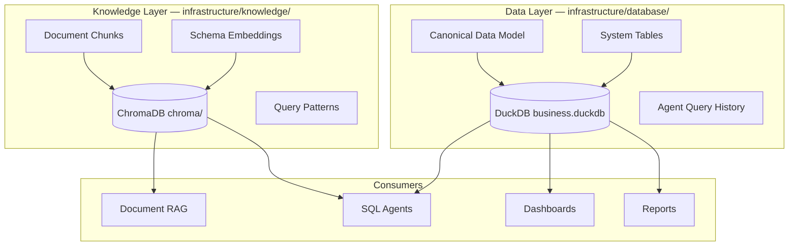

# ADR-005: Data Layer & Knowledge Layer

## Status

**Accepted (rev. 2)** — 2026-07-19  
*Rev. 2: Explicit separation of Data Layer (DuckDB) and Knowledge Layer (ChromaDB) as distinct infrastructure concerns.*

## Context

CLARIUS integrates diverse MSME data sources without replacing existing systems. Structured business data and semantic knowledge have **different responsibilities, lifecycles, and access patterns**. Treating both as generic "database infrastructure" obscures architectural boundaries and leads to incorrect coupling.

---

## Decision

### Two-Layer Storage Model

| Layer | Location | Engine | Stores |
|-------|----------|--------|--------|
| **Data Layer** | `infrastructure/database/` | DuckDB | Business transactions, CDM, system tables, agent metadata, job state references |
| **Knowledge Layer** | `infrastructure/knowledge/` | ChromaDB | Document embeddings, schema embeddings, query pattern embeddings |



**Rule:** No agent writes business facts to ChromaDB. No document embeddings stored in DuckDB (except metadata pointers).

---

## Data Layer (DuckDB)

### Why DuckDB

| Criterion | DuckDB | PostgreSQL |
|-----------|--------|------------|
| Embedded, no server process | Yes | No |
| Analytical query performance | Excellent | Good |
| MSME ops complexity | Zero config | Requires DBA |
| Single-file backup | Yes | Dump/restore |

Define `IStructuredStore` interface — PostgreSQL adapter for Enterprise tier post-MVP.

### Schema Namespaces

```sql
CREATE SCHEMA IF NOT EXISTS sys;      -- CLARIUS internal
CREATE SCHEMA IF NOT EXISTS cdm;      -- Canonical business model
CREATE SCHEMA IF NOT EXISTS staging;  -- Pre-transform imports
CREATE SCHEMA IF NOT EXISTS views;    -- User-defined saved queries
CREATE SCHEMA IF NOT EXISTS agent;    -- Agent artifacts
```

### Canonical Data Model (CDM) — Horizontal MSME

Core entities (MVP): `customers`, `suppliers`, `products`, `sales_invoices`, `sales_invoice_lines`, `purchase_invoices`, `purchase_invoice_lines`, `inventory_stock`, `payments`, `expenses`.

System tables: `sys.data_sources`, `sys.import_jobs`, `sys.schema_mappings`.

Agent tables: `agent.query_history`, `agent.conversation_messages`.

Industry-specific fields use `metadata JSON` columns. Full DDL in original ADR-005 spec — unchanged.

### DuckDB Configuration

```python
DUCKDB_CONFIG = {
    "threads": 4,
    "memory_limit": "4GB",
    "enable_object_cache": True,
}
```

Single writer, multiple readers. FastAPI connection pool (max 5).

### AI SQL Allowlist

```python
AI_QUERY_ALLOWLIST = ["cdm.*", "views.*"]
```

Enforced in `ai/guardrails/sql_validator.py`.

---

## Knowledge Layer (ChromaDB)

### Location

`{CLARIUS_DATA_ROOT}/knowledge/chroma/` — NOT under `database/`.

### Collections

| Collection | Content | Embedding Model | Used By |
|------------|---------|-----------------|---------|
| `documents` | PDF/OCR text chunks | `all-MiniLM-L6-v2` | Document RAG |
| `schema` | Table/column descriptions | `all-MiniLM-L6-v2` | Schema Retrieval Agent |
| `query_patterns` | Successful NL→SQL pairs | `all-MiniLM-L6-v2` | SQL Generation (few-shot) |

### Document Chunk Metadata

```python
{
    "source_file": "invoices/2026/inv_1234.pdf",
    "doc_type": "invoice",       # invoice | policy | manual | report
    "page": 1,
    "chunk_index": 0,
    "ocr_confidence": 0.94,
    "duckdb_ref": "sys.documents.id"  # pointer to Data Layer metadata
}
```

Document **metadata** (filename, upload date, owner) lives in DuckDB `sys.documents`. Document **content embeddings** live in ChromaDB. Cross-reference via ID.

### Knowledge Indexing Flow

Indexing is **always a background job** (ADR-008) — never blocks the API:

```
Document Uploaded → Job: OCR → Job: Chunk → Job: Embed → ChromaDB
Schema Changed    → Job: Re-embed schema collection
Import Complete   → Job: Update schema embeddings
```

---

## Import Pipeline

Connectors live in `plugins/data/` and `plugins/erp/` — not in infrastructure.

```python
# plugins/data/csv_connector.py implements:
class IConnector(Protocol):
    connector_type: str
    async def test_connection(self, config: dict) -> ConnectionResult: ...
    async def fetch_schema(self, config: dict) -> SourceSchema: ...
    async def fetch_records(self, config: dict, since: datetime | None) -> AsyncIterator[RecordBatch]: ...
```

**MVP Connectors:** CSV (P0), Excel (P0), REST API (P1), XML (P1). ERP plugins stubbed.

Import execution via background job:

```
POST /data-sources/{id}/sync → 202 Accepted → Job ID
GET  /jobs/{id}              → status, progress, errors
```

On completion, publish `DataImportCompleted` domain event (ADR-007).

---

## Repository Pattern

```python
# modules/analytics/domain/repositories.py
class ISalesRepository(Protocol):
    async def get_revenue_by_period(self, start: date, end: date, group_by: str) -> list[RevenueRow]: ...

# infrastructure/database/repositories/sales.py
class DuckDBSalesRepository(ISalesRepository): ...
```

```python
# infrastructure/knowledge/repositories/documents.py
class IKnowledgeRepository(Protocol):
    async def search_documents(self, query: str, top_k: int) -> list[DocumentChunk]: ...
    async def index_chunks(self, chunks: list[DocumentChunk]) -> None: ...
```

---

## Backup Strategy

| Layer | Asset | Backup |
|-------|-------|--------|
| Data | `database/business.duckdb` | File copy (stop or checkpoint) |
| Knowledge | `knowledge/chroma/` | Directory copy |
| Both | Include in backup job (ADR-008, Copilot) | Automated zip export |

Backup jobs must snapshot **both layers** — backing up DuckDB alone loses semantic search capability.

---

## Performance Targets

| Dataset | Data Layer | Knowledge Layer |
|---------|------------|-----------------|
| MVP (< 500K rows) | Sub-3s queries | < 2s retrieval (top-10) |
| Growth (1M+ rows) | Date partitioning, indexes | Collection pruning by doc age |

---

## Consequences

### Positive

- Clear ownership: analytics engineers work Data Layer; AI engineers work Knowledge Layer
- Independent scaling and backup strategies
- Prevents "everything in one DB" anti-pattern

### Negative

- Cross-layer consistency requires job orchestration (document deleted in DuckDB → purge ChromaDB chunks)
- Two stores to monitor at startup (splash screen reflects this)

---

## Alternatives Considered

| Alternative | Disadvantage |
|-------------|--------------|
| Both under `infrastructure/database/` | Obscures different responsibilities |
| ChromaDB only | No structured SQL analytics |
| DuckDB for embeddings | Wrong tool for vector search |

---

## References

- ADR-004: Agent Pipeline
- ADR-007: Domain Event Bus (`DataImportCompleted`, `DocumentIndexed`)
- ADR-008: Background Jobs (import, indexing)
- ADR-011: Plugin Architecture (connectors)
