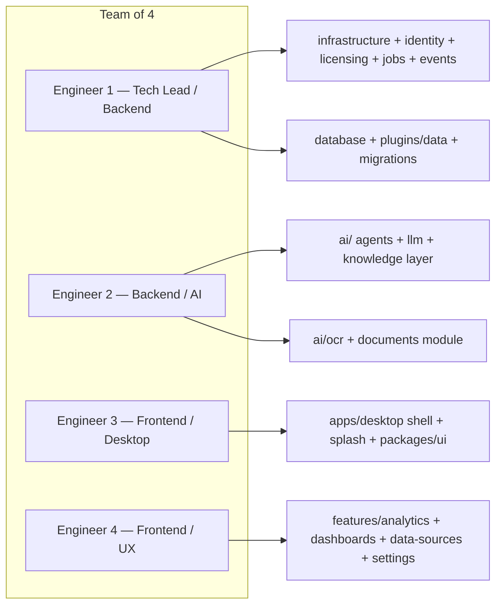
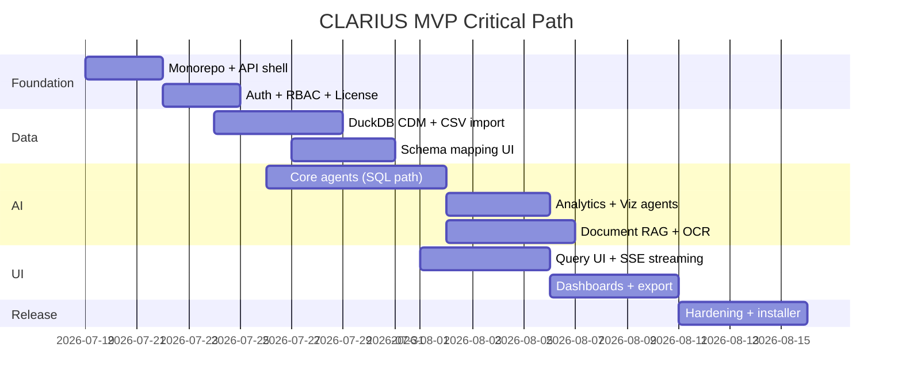

# ADR-006: MVP Delivery Plan (August 15, Team of 4)

## Status

**Accepted** — 2026-07-19

## Context

| Parameter | Value |
|-----------|-------|
| Team size | 4 engineers |
| Deadline | August 15, 2026 (~27 days from July 19) |
| Edition target | **CLARIUS Edition 1** (fully functional) |
| Vertical | All MSMEs (horizontal CDM, no industry modules) |
| Deployment | Single User + Office LAN |

Copilot and UNIVA ship as **capability-gated stubs** — visible in UI as upgrade prompts, not functional agents.

---

## Decision

Deliver a **vertical-agnostic CLARIUS MVP** with the core loop:

```
Import Data → Ask Question → Get Insight + Chart → Save to Dashboard
```

Defer all Copilot/UNIVA functional agents, ERP-native connectors (except REST/CSV/Excel), browser LAN client, and multi-branch.

---

## Team Structure & Module Ownership



### RACI Summary

| Module | Primary | Secondary |
|--------|---------|-----------|
| Monorepo scaffold, CI | Tech Lead | All |
| FastAPI shell, middleware | Tech Lead | Backend/AI |
| Identity + RBAC | Tech Lead | Frontend |
| Licensing | Tech Lead | — |
| DuckDB + CDM + Migrations | Tech Lead | Backend/AI |
| Background jobs + Event bus | Tech Lead | Backend/AI |
| Plugin host + data plugins | Tech Lead | Backend/AI |
| Hierarchical settings | Tech Lead | Frontend |
| `ai/` layer (all submodules) | Backend/AI | Tech Lead |
| Knowledge layer (ChromaDB) | Backend/AI | Tech Lead |
| Documents + OCR | Backend/AI | Frontend |
| Tauri + splash startup | Frontend/Desktop | Tech Lead |
| Design system (`packages/ui`) | Frontend/UX | Frontend/Desktop |
| `features/analytics` (SSE query UI) | Frontend/UX | Backend/AI |
| `features/dashboards` | Frontend/UX | Frontend/Desktop |
| `features/data-sources` (mapping wizard) | Frontend/UX | Tech Lead |
| `features/settings` (namespace tabs) | Frontend/UX | Tech Lead |

---

## Sprint Plan (4 Weeks)

### Week 1: Foundation (Jul 19 – Jul 25)

**Goal:** Runnable empty app with auth, license check, and data layer skeleton.

| Day | Tech Lead | Backend/AI | Frontend/Desktop | Frontend/UX |
|-----|-----------|------------|------------------|-------------|
| 1-2 | Monorepo scaffold, `infrastructure/jobs`, `infrastructure/events` skeleton | `ai/llm` Ollama client, agent interfaces | Tauri init, **splash startup sequence** | Design tokens, AppShell in `packages/ui` |
| 3-4 | RBAC + `infrastructure/settings` hierarchical store | DuckDB init, CDM migrations (ADR-009) | Sidecar spawn + startup status polling | Login page, setup wizard in `features/identity` |
| 5 | Licensing + MigrationService | ChromaDB init in `infrastructure/knowledge` | Auth flow integration | Settings tabs skeleton in `features/settings` |

**Week 1 exit criteria:**
- [ ] App starts with **staged splash screen** (license → API → DuckDB → ChromaDB → Ollama)
- [ ] Setup wizard creates Owner user
- [ ] License import works (valid / invalid / expired states)
- [ ] DuckDB CDM schema created via MigrationService
- [ ] Job queue operational (enqueue + status poll)
- [ ] Event bus registers core handlers
- [ ] `GET /health` and `GET /startup/status` return OK

### Week 2: Data Ingest + Agent Core (Jul 26 – Aug 1)

**Goal:** Import CSV/Excel, run NL query end-to-end (no chart yet).

| Focus | Deliverables |
|-------|-------------|
| Tech Lead | CSV + Excel **plugins**, schema mapping API, import via **background jobs** |
| Backend/AI | Core agents in `ai/agents/core/`, prompts in `ai/prompts/` |
| Frontend/Desktop | Data source wizard in `features/data-sources`, job progress polling |
| Frontend/UX | Column mapping UI, query input in `features/analytics` |

**Week 2 exit criteria:**
- [ ] Import 1000-row CSV into CDM
- [ ] NL query → validated SQL → result table
- [ ] Query history saved
- [ ] RBAC: Staff cannot import, Analyst can query

### Week 3: Intelligence + Documents (Aug 2 – Aug 8)

**Goal:** Full agent pipeline with charts, document upload + OCR.

| Focus | Deliverables |
|-------|-------------|
| Tech Lead | REST API connector (generic), views schema |
| Backend/AI | Analytics + Visualization agents, Document RAG, PaddleOCR |
| Frontend/Desktop | SSE streaming query results, ECharts rendering |
| Frontend/UX | Document library UI, dashboard list + view |

**Week 3 exit criteria:**
- [ ] Query returns analysis text + ECharts chart
- [ ] Upload PDF → OCR → ask document question → cited answer
- [ ] 3 pre-built dashboard templates (Sales Overview, Outstanding, Inventory)
- [ ] SSE streaming works smoothly

### Week 4: Hardening + Release (Aug 9 – Aug 15)

**Goal:** Production-ready CLARIUS Edition 1 installer.

| Day | All Hands Focus |
|-----|-----------------|
| 9-10 | Dashboard builder (save chart from query), report export (PDF/Excel) |
| 11 | LAN mode testing (2 clients), performance tuning |
| 11 | Audit log, error handling polish |
| 12 | Copilot/UNIVA stub screens + capability gates |
| 13 | Installer build (Windows), documentation |
| 14 | Bug bash, security review (SQL injection, auth bypass) |
| 15 | **Release candidate** |

**Week 4 exit criteria:**
- [ ] Save query result as dashboard widget
- [ ] Export report to PDF
- [ ] LAN mode: 2 users simultaneous
- [ ] Windows installer works on clean machine
- [ ] User guide (setup, import, query, dashboard)

---

## MVP Feature Matrix

### Ship (CLARIUS Edition — Functional)

| Feature | Module | Priority |
|---------|--------|----------|
| Setup wizard + local auth | identity | P0 |
| 5-role RBAC | rbac | P0 |
| Offline license import + validation | licensing | P0 |
| CSV import + column mapping | data-sources | P0 |
| Excel import | data-sources | P0 |
| Generic REST API connector | data-sources | P1 |
| NL query → SQL → results | analytics + agents | P0 |
| Streaming analysis + chart | analytics + agents | P0 |
| Query history / memory | agents | P0 |
| Document upload + OCR | documents | P0 |
| Document Q&A (RAG) | documents + agents | P0 |
| 3 dashboard templates | dashboards | P0 |
| Save chart to dashboard | dashboards | P1 |
| Report export (PDF) | reports | P1 |
| Audit log (admin view) | audit | P1 |
| Dark mode | ui | P1 |
| Background job queue + workers | P0 | ADR-008 — import/OCR/indexing |
| Domain event bus (core events) | P0 | ADR-007 — audit, indexing triggers |
| Migration service (DuckDB + settings) | P0 | ADR-009 — fresh install + upgrade |
| Hierarchical settings | P0 | ADR-010 — replaces monolithic settings.enc |
| Plugin host + CSV/Excel plugins | P0 | ADR-011 |
| Professional splash startup sequence | P0 | ADR-001 |
| Browser-ready API (CORS, SSE, JWT) | P0 | ADR-001 — browser UI post-MVP |

### Stub (Capability-Gated — UI Only)

| Feature | Shows |
|---------|-------|
| Predictive analytics | "Requires CLARIUS Copilot" |
| Trend analysis | Upgrade CTA |
| Root cause analysis | Upgrade CTA |
| Scheduled reports | Upgrade CTA |
| KPI monitoring | Upgrade CTA |
| Autonomous agents | "Requires UNIVA" |
| Workflow automation | Upgrade CTA |
| Multi-location | Upgrade CTA |

### Defer (Post Aug 15)

| Feature | Reason |
|---------|--------|
| ERPNext / Tally / Odoo native connectors | Integration complexity |
| Browser LAN client | Desktop sufficient for MVP |
| Multi-branch | License infra ready, logic deferred |
| ABAC | RBAC sufficient |
| Plugin marketplace | Interface only in MVP |
| Automated backup scheduler | Manual backup documented |
| PostgreSQL adapter | DuckDB sufficient for MVP scale |
| Report scheduler (cron) | Copilot feature |

---

## Critical Path



**Critical path item:** NL query pipeline (Week 2-3). If delayed, cut REST connector and report PDF export first.

---

## Risk Register

| Risk | Impact | Probability | Mitigation |
|------|--------|-------------|------------|
| Ollama/SQL quality insufficient | High | Medium | Validation loop + few-shot from query_patterns; demo dataset |
| Tauri sidecar packaging issues | High | Medium | Tech Lead spikes in Week 1 Day 1 |
| 4 engineers blocked on merge conflicts | Medium | High | Strict module boundaries; daily 15-min sync |
| PaddleOCR setup on Windows | Medium | Medium | Pre-build OCR in Week 1 spike; fallback: text-only PDF |
| Scope creep (ERP connectors) | High | High | ADR-006 is scope contract; redirect to post-MVP |
| Week 1 scope expanded (jobs, events, migrations, splash) | Medium | Medium | Jobs/events are minimal viable — not full scheduler |

---

## Definition of Done (Aug 15 Release)

1. **Functional:** Core loop works on clean Windows 10/11 install
2. **Secure:** SQL injection blocked, RBAC enforced on all routes, secrets encrypted
3. **Licensed:** CLARIUS edition fully gated; Copilot/UNIVA stubs show upgrade
4. **Documented:** Admin guide + fingerprint + license import instructions
5. **Tested:** Manual test script covering 20 critical paths
6. **Performance:** Simple query < 20s on 16GB RAM with Qwen 3 4B

---

## Daily Rituals (4-Person Team)

| Ritual | Frequency | Duration |
|--------|-----------|----------|
| Standup | Daily | 15 min |
| API contract review | Twice weekly | 30 min |
| Demo to team | Friday | 30 min |
| Scope guard (ADR-006) | When requested | Immediate |

---

## Post-MVP Roadmap (After Aug 15)

| Phase | Timeline | Focus |
|-------|----------|-------|
| 1.1 | Aug 16 – Sep 15 | ERPNext connector, report scheduler |
| 1.2 | Sep 16 – Oct 15 | CLARIUS Copilot functional agents |
| 2.0 | Oct 16 – Dec 15 | UNIVA workflow + approval agents |
| 2.1 | Q1 2027 | Multi-branch, PostgreSQL, plugin SDK |

---

## References

- ADR-000 through ADR-011
- All ADRs collectively define MVP scope boundaries
