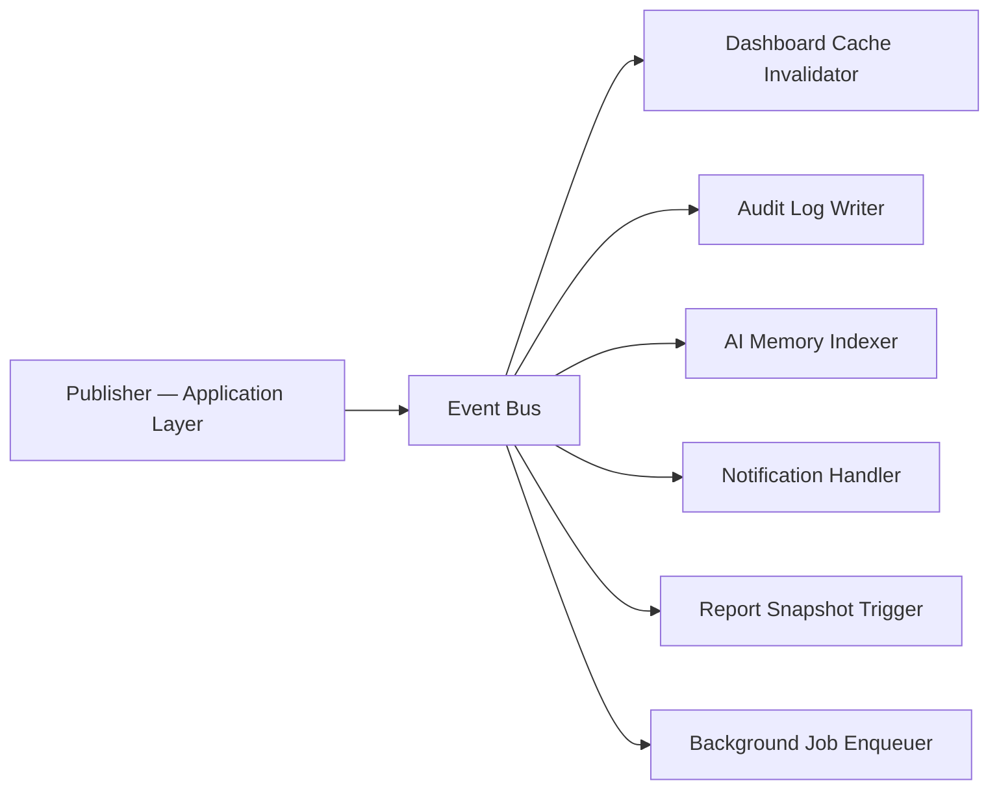

# ADR-007: Domain Event Bus

## Status

**Accepted** — 2026-07-19

## Context

As CLARIUS grows, modules need to react to business events without tight coupling. Example: when a data import completes, dashboards, audit logs, AI memory, and notification subscribers must update — but the import module should not know about all of them.

Direct module-to-module calls create dependency webs that become unmaintainable, especially with UNIVA workflow automation.

---

## Decision

Implement an **in-process Domain Event Bus** in `infrastructure/events/` with async subscriber dispatch. Events are defined in domain modules; bus infrastructure is shared.

### Architecture



### Event Definition (Domain)

Events live in the publishing module's `domain/events.py` or in `packages/shared-kernel/events/` for cross-cutting events:

```python
@dataclass(frozen=True)
class DomainEvent:
    event_id: str
    occurred_at: datetime
    aggregate_type: str
    aggregate_id: str
    correlation_id: str | None = None

@dataclass(frozen=True)
class DataImportCompleted(DomainEvent):
    data_source_id: str
    rows_imported: int
    duration_ms: int

@dataclass(frozen=True)
class DocumentUploaded(DomainEvent):
    document_id: str
    doc_type: str
    uploaded_by: str

@dataclass(frozen=True)
class QueryExecuted(DomainEvent):
    user_id: str
    session_id: str
    intent: str
    row_count: int

@dataclass(frozen=True)
class UserInvited(DomainEvent):
    invited_by: str
    new_user_id: str
    role_id: str
```

### Event Bus Interface

```python
# infrastructure/events/bus.py
class IEventBus(Protocol):
    async def publish(self, event: DomainEvent) -> None: ...
    def subscribe(self, event_type: type[DomainEvent], handler: EventHandler) -> None: ...

# Handler signature
EventHandler = Callable[[DomainEvent], Awaitable[None]]
```

### Dispatch Rules

| Rule | Detail |
|------|--------|
| Sync publish, async handlers | `publish()` awaits all handlers; failures logged, not propagated |
| Handler isolation | One handler failure does not block others |
| No ordering guarantee | Handlers must be idempotent |
| No event persistence (MVP) | In-memory dispatch; audit log is the durable record |
| Correlation ID | Propagated from HTTP request or job ID |

### MVP Event Catalog

| Event | Publisher | Subscribers |
|-------|-----------|-------------|
| `DataImportCompleted` | data-sources | audit, knowledge indexer (job), dashboard cache |
| `DocumentUploaded` | documents | audit, OCR job enqueuer |
| `DocumentIndexed` | jobs (OCR worker) | audit, AI memory |
| `QueryExecuted` | analytics | audit, query_patterns indexer (job) |
| `UserInvited` | identity | audit |
| `LicenseImported` | licensing | audit, capability cache refresh |
| `DashboardSaved` | dashboards | audit |

### Registration (Application Startup)

```python
# apps/api/startup.py
def register_event_handlers(bus: IEventBus) -> None:
    bus.subscribe(DataImportCompleted, audit_handler.on_data_import)
    bus.subscribe(DataImportCompleted, knowledge_handler.on_data_import)
    bus.subscribe(DocumentUploaded, job_handler.enqueue_ocr)
    ...
```

### Event Bus vs Background Jobs

| Use Event Bus | Use Background Job |
|---------------|-------------------|
| Fast reactions (< 1s) | Long work (> 1s) |
| Cache invalidation | CSV import |
| Audit log write | OCR processing |
| Enqueue a job | Embedding generation |
| Notify subscribers | ERP sync |

**Pattern:** Event handler enqueues a background job for heavy work:

```python
async def on_document_uploaded(event: DocumentUploaded) -> None:
    await job_queue.enqueue("ocr.process", {"document_id": event.document_id})
```

### Future: UNIVA Workflow Events

UNIVA workflow engine subscribes to business events as triggers:

```yaml
# plugins/automation/workflow_example.yaml
trigger:
  event: DataImportCompleted
  condition: "event.rows_imported > 0"
actions:
  - type: notify
    channel: manager
  - type: run_agent
    agent: trend_analysis
  - type: require_approval
    role: manager
```

---

## Consequences

### Positive

- Modules stay decoupled; new subscribers added without modifying publishers
- UNIVA workflow triggers fall naturally out of event catalog
- Testable: publish event, assert handler called

### Negative

- In-process bus does not survive process crash mid-dispatch (acceptable for MVP)
- Debugging async handler chains requires correlation IDs in logs
- Risk of handler proliferation — govern via ADR review for new subscribers

### Post-MVP Path

Persistent event store (DuckDB `sys.domain_events`) for replay and UNIVA audit trails. MVP uses audit log as durable subset.

---

## Alternatives Considered

| Alternative | Disadvantage |
|-------------|--------------|
| Direct module imports | Tight coupling; circular dependencies |
| Redis/RabbitMQ message broker | Overkill for single-server offline deployment |
| Polling | Latency; wasted CPU |
| Full Event Sourcing | Complexity beyond MVP needs |

---

## References

- ADR-000: Inter-module communication
- ADR-008: Background Jobs (heavy work offloaded from handlers)
- ADR-011: Automation plugins (UNIVA triggers)
