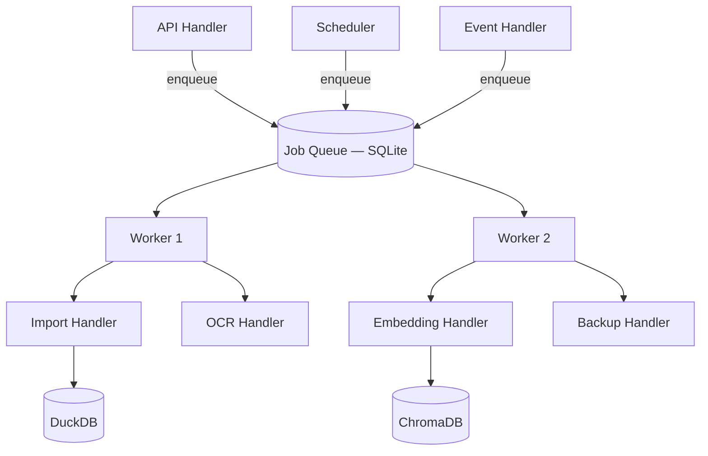

# ADR-008: Background Jobs Layer

## Status

**Accepted** — 2026-07-19

## Context

CLARIUS performs substantial asynchronous work even in offline mode: ERP sync, CSV import, OCR, embedding generation, schema indexing, scheduled reports, backup, and long-running agent tasks. Running these synchronously in API request handlers would block the UI, timeout HTTP connections, and make the system unusable on MSME hardware.

---

## Decision

Implement a **Background Services** layer in `infrastructure/jobs/` with a job scheduler, persistent queue, and worker pool — all running in-process within the FastAPI sidecar (no external broker).

### Architecture

```
Background Services (infrastructure/jobs/)
├── scheduler/          # Cron-like scheduling (Copilot+)
├── queue/              # Persistent job queue (SQLite)
├── workers/            # Async worker pool
├── registry/           # Job type → handler mapping
└── api/                # Job status endpoints
```



### Job Definition

```python
@dataclass
class Job:
    id: str
    type: str                    # "import.csv" | "ocr.process" | "embed.schema" | ...
    payload: dict
    status: JobStatus            # pending | running | success | failed | cancelled
    priority: int                # 0 (low) to 10 (high)
    created_at: datetime
    started_at: datetime | None
    completed_at: datetime | None
    progress: float              # 0.0 to 1.0
    progress_message: str | None
    error: str | None
    retry_count: int
    max_retries: int
    created_by: str | None       # user_id
    correlation_id: str | None

class JobStatus(str, Enum):
    PENDING = "pending"
    RUNNING = "running"
    SUCCESS = "success"
    FAILED = "failed"
    CANCELLED = "cancelled"
```

### Job Registry

```python
# infrastructure/jobs/registry.py
JOB_HANDLERS = {
    "import.csv":       CSVImportHandler,
    "import.excel":     ExcelImportHandler,
    "import.rest_api":  RESTImportHandler,
    "ocr.process":      OCRProcessHandler,
    "embed.documents":  DocumentEmbedHandler,
    "embed.schema":     SchemaEmbedHandler,
    "backup.create":    BackupHandler,
    "agent.long_run":   LongRunningAgentHandler,   # UNIVA
    "report.schedule":  ScheduledReportHandler,    # Copilot
}
```

Handlers live in their owning module or plugin — registered at startup.

### Queue Persistence

**Engine:** SQLite at `{CLARIUS_DATA_ROOT}/jobs/queue.db`

**Why SQLite for job queue (not DuckDB):**
- Lightweight concurrent writes for job status updates
- Does not compete with analytical DuckDB connections
- Standard pattern for embedded job queues

### Worker Pool

| Setting | MVP Value | Rationale |
|---------|-----------|-----------|
| Max concurrent workers | 2 | Protect 16GB RAM (Ollama + OCR + import) |
| Ollama jobs concurrency | 1 | GPU/CPU contention |
| OCR jobs concurrency | 1 | PaddleOCR memory |
| Import jobs concurrency | 1 | DuckDB single-writer |
| Poll interval | 1 second | Responsive without busy-wait |

**Priority queue:** User-triggered imports > background indexing > scheduled tasks.

### API Endpoints

```
POST   /jobs                    # Enqueue job (internal/admin)
GET    /jobs/{id}               # Status + progress
GET    /jobs?status=running     # List active jobs
POST   /jobs/{id}/cancel        # Cancel pending/running
GET    /jobs/types              # Available job types (capability-filtered)
```

User-facing actions return `202 Accepted` with job ID:

```
POST /data-sources/{id}/sync
→ 202 { "job_id": "job_abc123", "status_url": "/jobs/job_abc123" }
```

Frontend polls or subscribes via SSE `GET /jobs/{id}/stream`.

### MVP Job Types

| Job Type | Priority | Trigger | Edition |
|----------|----------|---------|---------|
| `import.csv` | High | User sync button | CLARIUS |
| `import.excel` | High | User sync button | CLARIUS |
| `ocr.process` | Medium | Document upload event | CLARIUS |
| `embed.documents` | Medium | After OCR complete | CLARIUS |
| `embed.schema` | Low | After import complete | CLARIUS |
| `backup.create` | Low | Manual admin action | CLARIUS |
| `report.schedule` | Low | Cron | Copilot (stub MVP) |
| `import.erp_sync` | High | Scheduled/manual | Copilot (stub MVP) |

### Scheduler (Copilot+)

```python
# infrastructure/jobs/scheduler.py
# MVP: Manual triggers only. Scheduler registers but inactive without copilot.scheduled_reports capability.

@scheduled(cron="0 6 * * *", capability="copilot.scheduled_reports")
async def daily_sales_report(): ...
```

### Startup Integration

Background workers start during startup sequence (ADR-001):

```
Stage: "loading_plugins" → Register job handlers
Stage: "starting_workers" → Start worker pool (2 workers)
```

Splash screen shows worker status.

### Error Handling & Retries

| Job Type | Max Retries | Backoff |
|----------|-------------|---------|
| Import | 2 | 30s, 120s |
| OCR | 1 | 60s |
| Embedding | 2 | 30s, 60s |
| Backup | 0 | Manual retry |

Failed jobs publish `JobFailed` event → audit log + admin notification (future).

### Graceful Shutdown

1. Stop accepting new jobs
2. Wait for running jobs (max 30s)
3. Mark interrupted jobs as `pending` for resume on next start
4. Close SQLite queue connection

---

## Consequences

### Positive

- API stays responsive during heavy operations
- Progress reporting enables professional import/OCR UX
- Foundation for Copilot scheduled reports and UNIVA automation
- Job history provides ops visibility

### Negative

- SQLite queue adds a third persistence store (DuckDB + ChromaDB + SQLite)
- Worker concurrency tuning requires real-hardware testing
- Job failure UX must be clear for non-technical MSME users

---

## Alternatives Considered

| Alternative | Disadvantage |
|-------------|--------------|
| Synchronous API only | Timeouts; blocked UI |
| Celery + Redis | External dependencies; overkill for offline single-server |
| DuckDB job table | Writer contention with analytics |
| asyncio.create_task (no persistence) | Jobs lost on crash |

---

## References

- ADR-001: Startup sequence includes worker boot
- ADR-005: Import and indexing jobs
- ADR-007: Events enqueue jobs
- ADR-009: Job queue schema migrations
