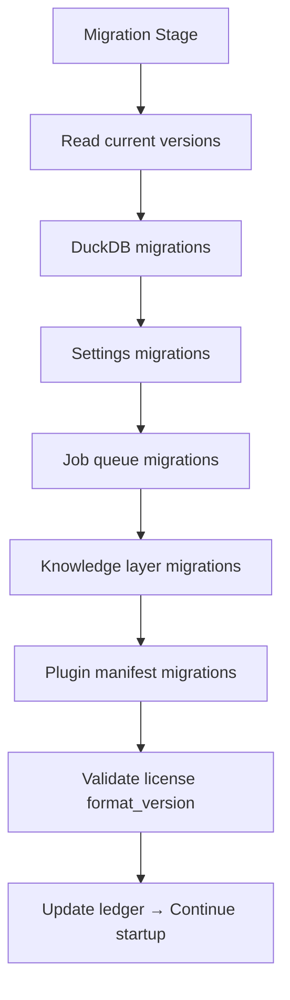

# ADR-009: Migration Service

## Status

**Accepted** — 2026-07-19

## Context

CLARIUS persists state across multiple stores (DuckDB schema, settings files, plugin manifests, license format versions, job queue schema). As the product evolves from MVP through Copilot to UNIVA, schema and configuration changes must apply **automatically and safely** on upgrade — without manual SQL scripts or customer data loss.

MSME customers will not have DBAs. Migrations must be invisible, idempotent, and recoverable.

---

## Decision

Implement a unified **Migration Service** that orchestrates versioned migrations across all persistent subsystems during the startup sequence (after sidecar boot, before plugins load).

### Migration Domains

| Domain | Store | Version Tracking |
|--------|-------|------------------|
| **DuckDB schema** | `database/business.duckdb` | `sys.schema_version` table |
| **Settings schema** | `settings/_version.json` | Per-namespace version files |
| **Job queue schema** | `jobs/queue.db` | `schema_version` table |
| **Plugin manifests** | `plugins/installed/` | Plugin `manifest_version` field |
| **License format** | `license/license.clar` | `format_version` in license file |
| **Knowledge collections** | ChromaDB | `knowledge/_meta.json` |

### Architecture

```
infrastructure/migrations/
├── service.py              # MigrationService orchestrator
├── runner.py               # Ordered execution with rollback
├── ledger.py               # Applied migrations ledger
├── duckdb/                 # SQL migration files
│   ├── 001_initial_cdm.sql
│   ├── 002_agent_tables.sql
│   └── ...
├── settings/               # Settings schema migrations
│   ├── v1_to_v2.py
│   └── ...
├── jobs/                   # Job queue schema migrations
├── knowledge/              # ChromaDB collection migrations
└── plugins/                # Plugin manifest upgraders
```

### Migration File Format (DuckDB)

```sql
-- migrations/duckdb/003_add_expenses.sql
-- version: 3
-- description: Add cdm.expenses table
-- reversible: true

-- UP
CREATE TABLE IF NOT EXISTS cdm.expenses ( ... );

-- DOWN
DROP TABLE IF EXISTS cdm.expenses;
```

### Migration Ledger

`{CLARIUS_DATA_ROOT}/migrations/ledger.json`:

```json
{
  "app_version": "1.0.0",
  "applied": [
    {
      "domain": "duckdb",
      "version": 3,
      "migration_id": "003_add_expenses",
      "applied_at": "2026-08-01T10:00:00Z",
      "duration_ms": 142
    },
    {
      "domain": "settings",
      "version": 2,
      "migration_id": "settings_v1_to_v2",
      "applied_at": "2026-08-01T10:00:01Z",
      "duration_ms": 8
    }
  ]
}
```

### MigrationService Interface

```python
class IMigrationService(Protocol):
    async def get_pending(self) -> list[PendingMigration]: ...
    async def run_all(self) -> MigrationResult: ...
    async def run_domain(self, domain: str) -> MigrationResult: ...
    async def get_current_versions(self) -> dict[str, int]: ...
```

### Execution Order (Startup)



**Critical:** DuckDB migrations run **before** any module accesses the database.

### Rules

| Rule | Detail |
|------|--------|
| Idempotent | `IF NOT EXISTS`, check ledger before apply |
| Sequential | Version N requires N-1 applied |
| Forward-only (MVP) | Down migrations for dev/test only |
| Backup prompt | Warn if > 100K rows and breaking migration (post-MVP auto-backup) |
| Atomic per migration | One migration = one transaction where possible |
| Fail fast | Migration failure → startup error screen with rollback attempt |

### Settings Migration Example

When settings schema changes from v1 (monolithic) to v2 (hierarchical):

```python
# migrations/settings/v1_to_v2.py
def upgrade(settings_dir: Path) -> None:
    old = decrypt(settings_dir / "settings.enc")
    split_into_namespaces(old, settings_dir)
    write_version(settings_dir, 2)
    archive_old(settings_dir / "settings.enc.bak")
```

### License Format Versioning

License file includes `format_version: 1`. Migration service validates compatibility:

| App Version | Supported License Format |
|-------------|-------------------------|
| 1.x | format_version 1 |
| 2.x | format_version 1, 2 (auto-upgrade metadata on import) |

App never rejects older licenses if format is forward-compatible.

### Plugin Manifest Migration

When plugin API version changes:

```python
# plugins/erp/erpnext/manifest.json
{
  "plugin_id": "erpnext",
  "plugin_api_version": 1,
  "min_clarius_version": "1.0.0"
}
```

Migration service upgrades stored plugin configs when `plugin_api_version` bumps.

### Startup UX

Splash screen stage: **"Running Migrations"**

```
Running database updates... (2 of 3)
```

If migrations take > 5 seconds, show progress bar. Never show raw SQL to users.

### Development Workflow

```bash
# Create new DuckDB migration
just migration-new duckdb "add_customers_index"

# Run migrations in dev
just migrate

# Check status
just migrate-status
```

---

## Consequences

### Positive

- Seamless upgrades for MSME customers
- Single orchestration point for all persistent state
- Ledger provides audit trail of schema changes
- Team can evolve schema confidently post-MVP

### Negative

- Migration authoring discipline required from all engineers
- Testing matrix grows (fresh install vs upgrade from N-1)
- ChromaDB migrations less mature than SQL migrations

### Testing Requirements

| Scenario | Required Test |
|----------|---------------|
| Fresh install | All migrations apply on empty state |
| Upgrade N-1 → N | Seed N-1 data, run migrations, verify integrity |
| Idempotency | Run migrations twice, no error |
| Failure recovery | Kill mid-migration, restart, resume or rollback |

---

## Alternatives Considered

| Alternative | Disadvantage |
|-------------|--------------|
| Alembic only (DuckDB) | Does not cover settings, plugins, knowledge |
| Manual migration scripts | MSME customers will not run them |
| Drop and recreate | Data loss unacceptable |
| Per-module migrations | No global ordering; dependency conflicts |

---

## References

- ADR-001: Startup sequence includes migration stage
- ADR-005: DuckDB schema ownership
- ADR-010: Settings schema versions
- ADR-011: Plugin manifest versions
