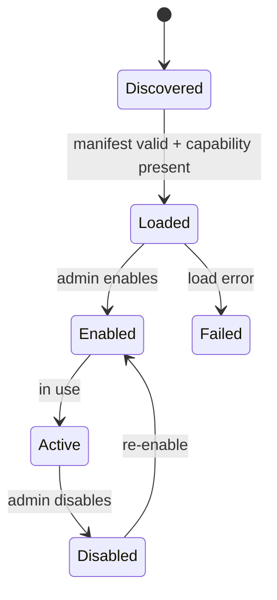

# ADR-011: Plugin Architecture

## Status

**Accepted** — 2026-07-19

## Context

CLARIUS must integrate with diverse ERP systems, data formats, AI extensions, automation workflows, and export formats — without hardcoding integrations into core modules. UNIVA's custom plugins and ERP connectors depend on a formal plugin system from day one, even if MVP ships only built-in plugins.

---

## Decision

Implement a **Plugin Host** in `plugins/` with categorized plugin types, manifest-based registration, capability gating, and lifecycle hooks. Core code never imports plugin implementations directly — only interfaces.

### Plugin Taxonomy

```
plugins/
├── erp/                    # ERP system connectors
│   ├── erpnext/            # stub MVP
│   ├── tally/              
│   ├── odoo/               # stub MVP
│   └── busy/               # stub MVP
├── data/                   # File and API data sources
│   ├── csv/
│   ├── excel/
│   ├── xml/
│   └── rest_api/
├── ai/                     # Custom AI agent plugins
│   └── (UNIVA — custom agents)
├── automation/             # Workflow and BPA plugins
│   └── (UNIVA — workflow actions)
└── exports/                # Report and data exporters
    ├── pdf/
    └── excel/
```


### Plugin Categories & Interfaces


| Category       | Interface         | Location              | MVP        |
| -------------- | ----------------- | --------------------- | ---------- |
| **ERP**        | `IERPConnector`   | `plugins/erp/`        | Stub       |
| **Data**       | `IDataConnector`  | `plugins/data/`       | CSV, Excel |
| **AI**         | `IAgentPlugin`    | `plugins/ai/`         | Stub       |
| **Automation** | `IWorkflowPlugin` | `plugins/automation/` | Stub       |
| **Export**     | `IExportPlugin`   | `plugins/exports/`    | PDF        |


### Plugin Manifest

Each plugin includes `manifest.json`:

```json
{
  "plugin_id": "csv",
  "name": "CSV Import",
  "category": "data",
  "version": "1.0.0",
  "plugin_api_version": 1,
  "min_clarius_version": "1.0.0",
  "required_capabilities": ["clarius.data_import"],
  "entry_point": "plugins.data.csv.connector:CSVConnector",
  "config_schema": "config_schema.json",
  "description": "Import data from CSV files with column mapping"
}
```


### Plugin Host

```python
# plugins/host.py
class PluginHost:
    def discover(self) -> list[PluginManifest]: ...
    def load(self, plugin_id: str) -> Plugin: ...
    def get_by_category(self, category: PluginCategory) -> list[Plugin]: ...
    def is_enabled(self, plugin_id: str) -> bool: ...
```

**Discovery order:**

1. Built-in plugins (bundled in `plugins/`)
2. Installed plugins (`{CLARIUS_DATA_ROOT}/plugins/installed/`)


### Interface Definitions

```python
# plugins/interfaces/data.py
class IDataConnector(Plugin):
    async def test_connection(self, config: dict) -> ConnectionResult: ...
    async def discover_schema(self, config: dict) -> SourceSchema: ...
    async def fetch_records(self, config: dict, since: datetime | None) -> AsyncIterator[RecordBatch]: ...

# plugins/interfaces/erp.py
class IERPConnector(IDataConnector):
    async def get_entities(self) -> list[ERPEntity]: ...
    async def sync_entity(self, entity: str, since: datetime | None) -> SyncResult: ...

# plugins/interfaces/export.py
class IExportPlugin(Plugin):
    async def export(self, data: ExportData, options: dict) -> ExportResult: ...

# plugins/interfaces/automation.py  (UNIVA)
class IWorkflowPlugin(Plugin):
    async def execute_action(self, action: WorkflowAction, context: dict) -> ActionResult: ...
    def get_action_schema(self) -> dict: ...
```


### Plugin Lifecycle




**Startup (splash stage "Loading Plugins"):**

1. Discover all manifests
2. Validate `plugin_api_version` compatibility
3. Filter by license capabilities
4. Load enabled plugins into registry
5. Register job handlers from plugins


### Plugin Configuration

Plugin config stored in settings namespace `integrations`:

```json
{
  "plugins": {
    "csv": { "enabled": true },
    "excel": { "enabled": true },
    "erpnext": {
      "enabled": false,
      "config_ref": "vault:plugins.erpnext"
    }
  }
}
```

Plugin-specific secrets always in vault.

### Capability Gating


| Plugin               | Required Capability                                  |
| -------------------- | ---------------------------------------------------- |
| csv, excel, rest_api | `clarius.data_import`                                |
| erpnext, tally, odoo | `clarius.erp_connector` (future) or edition-specific |
| pdf export           | `clarius.reports`                                    |
| scheduled export     | `copilot.scheduled_reports`                          |
| workflow plugins     | `univa.workflow_automation`                          |
| custom AI agents     | `univa.custom_plugins`                               |


Disabled-by-license plugins appear in UI as "Requires upgrade" — not hidden.

### Data Source UI Integration

Frontend data source wizard queries plugin registry:

```
GET /plugins?category=data
→ [{ plugin_id: "csv", name: "CSV Import", enabled: true }, ...]
```

User selects plugin → plugin renders config form from `config_schema.json` (JSON Schema).

### Error Isolation

Plugin load failure does not crash the app:

```
Plugin "tally" failed to load: Missing dependency xyz
→ Logged, shown in Admin → Plugins screen
→ Other plugins continue normally
```


### Future: Third-Party Plugins (UNIVA)

```
{CLARIUS_DATA_ROOT}/plugins/installed/
└── custom_erp_connector/
    ├── manifest.json
    ├── connector.py
    └── config_schema.json
```

Signed plugin packages (post-MVP) verified against vendor public key.

---


## Consequences


### Positive

- ERP integrations never pollute core modules
- New connectors shippable independently
- UNIVA automation plugins have clear home
- UI dynamically adapts to available plugins


### Negative

- Plugin API versioning discipline required from v1
- Interface design must anticipate ERP diversity
- Testing matrix: N plugins × M CLARIUS versions

---


## Alternatives Considered


| Alternative                            | Disadvantage                           |
| -------------------------------------- | -------------------------------------- |
| Hardcoded connectors in infrastructure | Unmaintainable at ERP scale            |
| Single `connectors/` folder            | No categorization; becomes junk drawer |
| Dynamic Python import without manifest | No capability gating; security risk    |
| Microservice per ERP                   | Ops burden for MSME offline deployment |


---


## References

- ADR-005: Import pipeline uses data plugins
- ADR-008: Plugin job handler registration
- ADR-009: Plugin manifest migrations
- ADR-002: Capability gating

